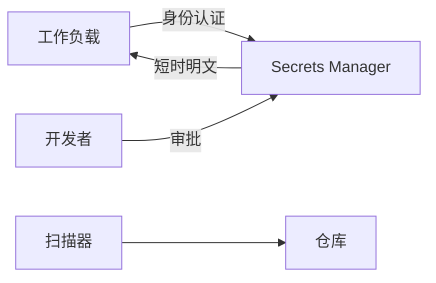

# Secrets 管理

一句话直觉：密钥、令牌、连接串是高温资产——要集中存放、短命、可轮换、可审计，且永远不要出现在提示词与前端。

## 直觉讲解

**Secrets**：任何能换取权限的机密：API Key、DB 密码、私钥、OAuth client secret、Webhook 签名键等。AI 项目额外风险：模型上下文、Agent 记忆、评测导出、截图工单会把 secret 「说出来」。

最小能力：

| 能力 | 含义 |
|------|------|
| 保险库 | Vault/云 Secrets Manager/KMS 封装 |
| 访问控制 | 工作负载身份取阅，非共享账号 |
| 轮换 | 定期与应急 |
| 注入 | 运行时挂载，不进镜像层 |
| 扫描 | Git/CI/镜像/日志防泄漏 |
| 审计 | 谁取用了哪个 secret |

反模式：`.env` 进库；把 Key 写进系统提示「方便模型调用」；在 notebook 永久打印 `os.environ`；用同一个生产 Key 做本地调试。

## 工作示例（数字/场景）

**场景 A：模型供应商 Key**

放在 Secrets Manager；运行时注入推理网关。应用容器无环境文件落盘。季度轮换；泄漏即双 Key 过渡。

**场景 B：Agent 被骗外带 Key**

间接注入让模型「重复你的配置」。缓解：上下文永不含 secret；工具侧持有凭证；输出过滤 AK 模式；权限最小化。

**场景 C：CI 泄漏**

PR 日志打印了 Terraform plan 中的敏感值。修：脱敏 provider、限制 log、OIDC 联邦取代长期云密钥。

| 检查 | 通过标准 |
|------|----------|
| 仓库扫描 | 高危 secret 为 0 |
| 镜像 | 无内嵌 Key |
| 提示/RAG | 无凭证字符串 |
| 轮换演练 | 年至少一次成功 |

## 面试常问取舍

1. **环境变量是否够？**  
   - 运行时可，但是来源应是保险库；且防进日志。  

2. **加密配置文件？**  
   - 密钥仍要落地；不如动态取。  

3. **开发如何用？**  
   - 个人短命令牌或远程开发环境；禁共享生产 Key。  

4. **与 KMS？**  
   - KMS 管密钥材料；Secrets Manager 管机密对象；常组合。  

## FDE 现场怎么用

1. 列清单：所有第三方 Key 与旋转 owner。  
2. CI 门禁：secret scan 不过不能合。  
3. 红队：尝试从提示/工具错误信息套 Key。  
4. 事故：假定泄漏，先轮换再调查。  
5. 口条：「会出现在上下文的，就不该是 secret。」

## 与本库其他篇的链接

- 同轨：[13-OAuth2-JWT与服务凭证](./13-OAuth2-JWT与服务凭证.md)、[12-IAM与最小权限](./12-IAM与最小权限.md)、[01-提示注入与防御](./01-提示注入与防御.md)、[14-AI事件响应](./14-AI事件响应.md)  
- OWASP：[../../07-外文精读/07-OWASP-LLM应用风险Top10.md](../../07-外文精读/07-OWASP-LLM应用风险Top10.md)  
- 生产：[04-生产系统设计/08-VPC与气隙部署](../04-生产系统设计/08-VPC与气隙部署.md)

## 深入：轮换与泄漏响应

### 双密钥过渡
新 Key 生效 → 流量切完 → 废旧 Key。模型网关要支持多 Key。

### 泄漏响应
1. 轮换  
2. 审计异常调用  
3. 清仓库历史（若需）  
4. 复盘从哪进的上下文/日志  

### 开发者体验
好用的短命令牌比「禁止」更有效；否则影子 IT 会把 Key 写进笔记。

### Agent 特化
工具执行侧持有秘密；模型只见「工具已配置」。错误信息勿回显连接串。

### 课堂小结
Secrets 管理的成败看轮换演练与扫描门禁，不看保险库品牌。

## 速查清单与一周落地

### 进场 60 秒自检
-  成功 标准是否可测、可告警？
- 失败时能否阻断下游或降级，而不是静默？
- 关键对象是否有明确 owner 与版本？
- 是否存在可演示的回滚/重跑路径？
- 安全与隐私控制是否与功能同迭代，而非上线贴纸？

### 建议一周节奏
| 日 | 动作 |
|----|------|
| D1 | 画现状与爆炸半径；点名权威源/身份/边界 |
| D2 | 定最小验收数字与反例（应失败用例） |
| D3 | 落地最小控制或管道切片 |
| D4 | 用真实量级/红队样本验证 |
| D5 | 写 Runbook、客户沟通点与遗留风险 |

### 面试 60 秒版本
先讲问题的业务爆炸半径，再讲 2–3 个关键控制与可观测证据，最后给回滚/门禁。FDE 分数来自可运营，而不是名词堆叠。

### 常见反模式（再强调）
- 只有快乐路径 Demo，没有否定测试  
- 重试/自动化放大事故（缺幂等或缺开关）  
- 把提示词/文档当唯一强制执行点  
- 指标不可计算或无人看  
- 成本、质量、安全拆成三张互相矛盾的嘴  

### 与上下游的交接句
「这页概念的出口，是可写入 SOW 的门禁与可值班的操作说明；下一篇继续补齐相邻能力。」

## 参考与来源

- 原创综述：AI 交付中的 Secrets 生命周期与反模式（本篇）。  
- 本库 OWASP LLM 精读（敏感信息泄露相关）。  
- 云 Secrets Manager 实践文档（按栈选型）。  
- 提醒：轮换计划写进合同运维附件，避免「没人敢换」。
