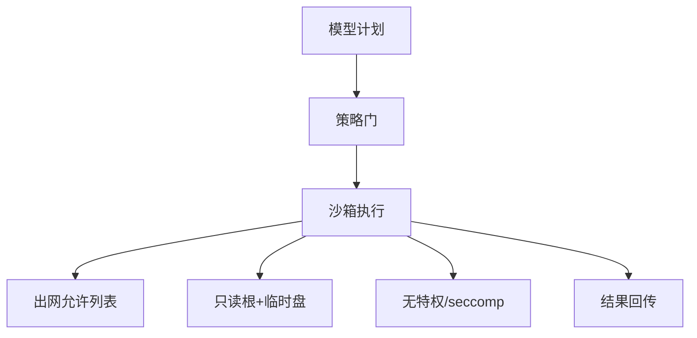

# Agent 沙箱与执行隔离

一句话直觉：Agent 一旦能执行代码、操作文件或调工具，就需要沙箱——把「会思考」关在「不能随便碰真世界」的笼子里。

## 直觉讲解

**沙箱（Sandbox）**：限制进程可用的系统资源、网络、文件系统与机密的执行环境。**执行隔离**还包括：容器/VM/微 VM、seccomp、网络策略、独立身份与会话级临时目录。

Agent 特有威胁：

| 威胁 | 说明 |
|------|------|
| 任意代码执行 | 模型生成 `os.system` 清盘 |
| 数据外带 | 读秘密后 HTTP POST 出去 |
| 逃逸 | 容器逃逸打宿主 |
| 横向 | 内网扫描与打相邻服务 |
| 持久化 | 写 crontab/启动项 |

分层：提示护栏（弱）→ 工具允许列表（中）→ 沙箱与网络策略（强）→ HITL（高危）。只靠「请勿执行危险命令」等于不设防。

## 工作示例（数字/场景）

**场景 A：数据分析 Agent**

允许在微 VM 跑 Python 看用户上传 CSV；禁止访问云元数据 IP、禁止读 `/var/run` 凭证、出网仅包索引白名单（或完全离线预装包）。会话结束销毁磁盘。

**场景 B：运维 Agent**

生产变更不直接给 shell；改为调用受控 API（重启某服务）且双人审批。沙箱里甚至没有 kubectl。

**场景 C：代码修复 Agent**

挂载只读仓库副本 + 可写 worktree；禁推 force；CI 令牌短命且范围限于单仓库。

| 控制 | 基线 |
|------|------|
| 特权 | 非 root、无 Docker socket |
| 文件系统 | 最小挂载 |
| 网络 | 默认否认，显式 DNS/CIDR |
| 资源 | CPU/内存/时间配额 |
| 机密 | 不进沙箱；由侧车代调用 |

## 面试常问取舍

1. **容器够不够？**  
   - 看威胁；高危代码执行倾向微 VM/gVisor 类更强隔离。  

2. **全离线沙箱？**  
   - 最安全，包管理痛苦；按客户威胁选。  

3. **与提示注入关系？**  
   - 注入常试图驱动工具；沙箱减爆炸半径。见注入篇。  

4. **多租户共用沙箱池？**  
   - 防残留与串租：一会话一环境，强清理。  

## FDE 现场怎么用

1. 工具能力分级：读/写/执行/出金，执行默认进沙箱。  
2. 画网络图：沙箱能否碰元数据与内网。  
3. 验收：故意让模型尝试读 secret/出网，应失败。  
4. 与 IR 联动：一键冻结沙箱镜像与网络。  
5. 口条：「能执行的智能，必须能被关进笼子。」

## 与本库其他篇的链接

- 同轨：[01-提示注入与防御](./01-提示注入与防御.md)、[10-RBAC-ABAC与Agent运行时身份](./10-RBAC-ABAC与Agent运行时身份.md)、[15-Secrets管理](./15-Secrets管理.md)、[14-AI事件响应](./14-AI事件响应.md)、[06-多租户与数据隔离](./06-多租户与数据隔离.md)  
- Agent：[02-检索与Agent/07-AI-Agent与工具使用](../02-检索与Agent/07-AI-Agent与工具使用.md)、[20-有界自主与人在回路](../02-检索与Agent/20-有界自主与人在回路.md)  
- OWASP：[../../07-外文精读/07-OWASP-LLM应用风险Top10.md](../../07-外文精读/07-OWASP-LLM应用风险Top10.md)  
- 生产：[04-生产系统设计/13-客户部署的容器与K8s](../04-生产系统设计/13-客户部署的容器与K8s.md)

## 深入：能力分级与验收攻击

### 能力分级表示例
| 级别 | 能力 | 控制 |
|------|------|------|
| L0 | 只读检索 | ACL |
| L1 | 写工单 | 幂等+审计 |
| L2 | 跑代码 | 沙箱+配额 |
| L3 | 生产变更/资金 | HITL+双人 |

### 验收攻击脚本（概念）
读 `/proc`、访元数据 IP、扫内网、写 SSH key、外带环境变量——皆应失败。

### 镜像供应链
沙箱基镜像签名与漏洞扫描； steed 预装包清单冻结。

### 多会话残留
测：会话A写文件，会话B是否可见——必须不可见。

### 课堂小结
沙箱与身份、密钥、IR 开关是一套积木；Agent 越能干，笼子越要硬。

## 速查清单与一周落地

### 进场 60 秒自检
-  成功 标准是否可测、可告警？
- 失败时能否阻断下游或降级，而不是静默？
- 关键对象是否有明确 owner 与版本？
- 是否存在可演示的回滚/重跑路径？
- 安全与隐私控制是否与功能同迭代，而非上线贴纸？

### 建议一周节奏
| 日 | 动作 |
|----|------|
| D1 | 画现状与爆炸半径；点名权威源/身份/边界 |
| D2 | 定最小验收数字与反例（应失败用例） |
| D3 | 落地最小控制或管道切片 |
| D4 | 用真实量级/红队样本验证 |
| D5 | 写 Runbook、客户沟通点与遗留风险 |

### 面试 60 秒版本
先讲问题的业务爆炸半径，再讲 2–3 个关键控制与可观测证据，最后给回滚/门禁。FDE 分数来自可运营，而不是名词堆叠。

### 常见反模式（再强调）
- 只有快乐路径 Demo，没有否定测试  
- 重试/自动化放大事故（缺幂等或缺开关）  
- 把提示词/文档当唯一强制执行点  
- 指标不可计算或无人看  
- 成本、质量、安全拆成三张互相矛盾的嘴  

### 与上下游的交接句
「这页概念的出口，是可写入 SOW 的门禁与可值班的操作说明；下一篇继续补齐相邻能力。」

## 参考与来源

- 原创综述：Agent 执行隔离基线与场景化取舍（本篇）。  
- 本库 OWASP LLM 精读与有界自主篇。  
- 容器/微 VM 隔离技术公开资料（按客户平台选型）。  
- 提醒：沙箱不是一次配置终身安全，要跟工具能力变更一起评审。
