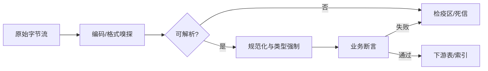

# 01 · 脏数据解析

一句话直觉：生产数据几乎从不「干净」——解析的任务不是假设格式，而是在破损、混编码、半结构化噪声里仍抽出可验证字段。

## 直觉讲解

**脏数据解析**指：从 CSV/JSONL/日志/导出表/半结构化文本中，把业务字段变成类型正确、可追溯、失败可隔离的记录。它和「写个 `json.loads`」的差别在于：**坏行是常态**，你要设计失败面，而不是只设计快乐路径。

常见脏源：

| 脏类型 | 表现 | 若不处理 |
|--------|------|----------|
| 编码混用 | UTF-8 / GBK / Latin-1 交错 | 乱码进向量库，检索永久脏 |
| 分隔符漂移 | 逗号/制表/管道混用；字段内未转义 | 列错位，静默错账 |
| 类型漂移 | 同一列有数字、空串、`"N/A"`、千分位 | 聚合错、模型特征炸 |
| 嵌套泄漏 | 一列里塞 JSON 字符串或 HTML | schema 假稳定 |
| 迟到/重复 | 同一主键多版本、乱序到达 | 双计费、状态回退 |
| 控制字符 | BOM、零宽空格、`\r` | 「看起来相等」却匹配失败 |



FDE 视角：解析层是 **契约边界**。下游 RAG、Agent、报表都默认「字段已可信」——解析偷懒，后面所有「智能」都在放大错误。

## 工作示例（数字/场景）

**场景 A：客户「标准 CSV」导出**

财务系统导出 120 万行费用。抽 2k 行发现：

- 3% 行用 `;` 分隔（欧陆区域设置）
- 金额列混有 `"1,234.56"` 与 `"1234,56"`
- 约 0.4% 行在备注字段含未转义换行，导致 pandas 默认读崩

错误做法：`on_bad_lines='skip'` 静默丢掉 4k+ 行，试点指标好看，生产对账差 2%。  
正确做法：行级解析器 + 失败行进检疫区；每日报告「失败率 / Top 失败原因 / 金额敞口」。

**场景 B：日志里抽「订单 ID」**

日志格式「大体稳定」但中间插过一次 schema 变更：旧行 `order_id=`，新行 `"orderId":`。正则只认一种 → 召回腰斩。  
做法：多模式解析器 + 版本字段；用金标日志片段做回归（见可测试性篇）。

**场景 C：JSONL 半坏**

1e6 行 JSONL，其中 87 行缺闭合括号。整文件 `json.load` 失败。应改为**逐行 decode**，坏行记 offset，好行继续——吞吐与可恢复性同时保住。

## 面试常问取舍

1. **严格失败 vs 尽力解析**  
   - 严格：任何类型错误整批失败——适合资金对账。  
   - 尽力：坏行隔离、好行放行——适合日志/检索语料。  
   - 口述要点：说出**业务代价**再选，不要先选库函数参数。

2. **先规范化再入库 vs 原样存 + 视图清洗**  
   - 原样保留利于追责与重放；对外消费走规范化视图。  
   - 两边都要有主键与解析版本号。

3. **手写解析 vs 通用工具**  
   - 工具加速探索；生产路径要可单测、可度量失败率。  
   - 「用了 pandas」不是设计，**失败合同**才是。

4. **编码自动检测可靠吗？**  
   - 启发式会误判短文本。关键管道应用「声明编码 + 抽样校验 + 失败告警」。

## FDE 现场怎么用

- **进场第一天**：要「最脏的 50 个文件/导出切片」，不是宣传用的样例。  
- **写进范围**：支持的格式、明确不支持的格式、失败行处理 SLO（如失败率 >1% 阻断索引）。  
- **可观测**：解析成功率、按文件/来源的失败直方图、检疫区积压。  
- **与客户对齐**：坏数据是**共同问题**；展示检疫样本比争论「你们数据有问题」更有效。  
- **工程清单**：解析器版本、schema 版本、重放脚本三位一体。

## 与本库其他篇的链接

- 同轨：[02-可测试性与依赖注入](./02-可测试性与依赖注入.md)、[09-数值稳定性](./09-数值稳定性.md)  
- 检索侧：[文档解析与抽取](../02-检索与Agent/31-文档解析与抽取.md)、[切块策略](../02-检索与Agent/04-切块策略Chunking.md)  
- 交付：[反模式与踩坑](../../02-交付方法论/反模式与踩坑.md)  
- 面试编码：[编码与Learning轮](../../04-面试通关/编码与Learning轮.md)

## 深入：解析合同怎么写

### 最小 schema 合同

```text
record_id: 稳定主键（或哈希）
source: 文件/表/topic + 偏移
parsed_at / parser_version
fields: 类型强制后的业务字段
quality_flags: 枚举（truncated_field, coerced_number, ...）
```

下游禁止直接读原始字节列当真相；需要原文时走 `raw_ref`。

### 三层校验

1. **语法层**：能否切成行/对象  
2. **类型层**：强制转换与范围  
3. **业务层**：外键存在、金额守恒、状态机合法  

层 3 失败不一定丢弃——可进「人工队列」并冻结自动化动作。

### 常见误区

- 用平均值掩盖长尾坏行（P99 文件毁一天批处理）。  
- 在 LLM Prompt 里「让模型修 CSV」当生产解析——不可审计、不可回归。  
- 清洗把主键洗丢，重放时无法对齐。

## 课堂小结

脏数据解析的交付物不是「能读」，而是：**成功率可测、失败可隔离、版本可重放**。下一篇讲如何把解析与业务逻辑拆成可测边界。

## 参考与来源

- 原创综述：现场导出/日志/JSONL 失败模式与检疫区实践（本篇）  
- 本库文档解析与 RAG 语料治理相关篇  
- Python csv / JSONL 逐行解码等标准库实践（以官方文档为准）
