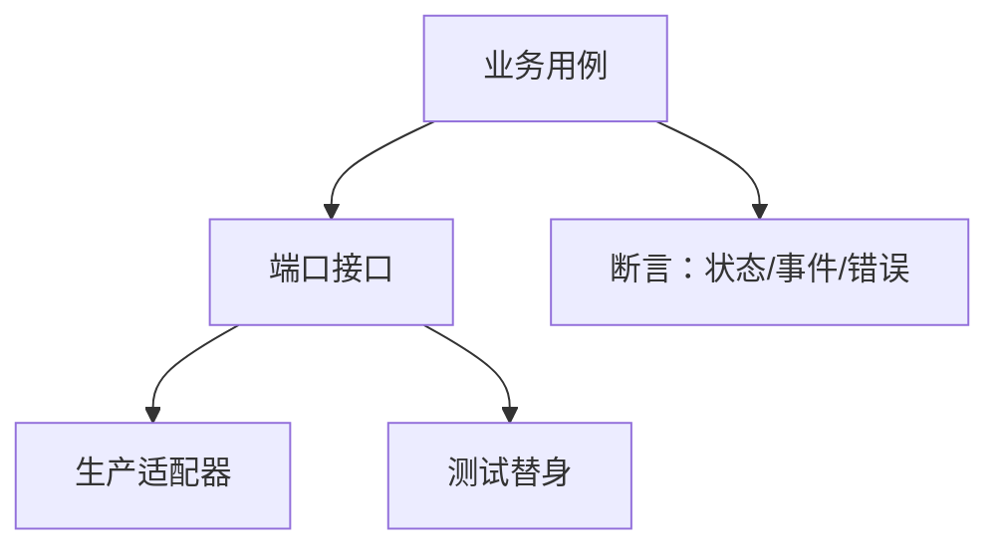

# 02 · 可测试性与依赖注入

一句话直觉：测不动的代码通常不是「缺测试框架」，而是**边界没切开**——把时钟、网络、模型、时钟副作用拧成可替换接口，可测性才会出现。

## 直觉讲解

**可测试性**是设计属性：用小成本对行为做可重复断言。**依赖注入（DI）**是实现手段之一：调用方不自己 `new` 外部世界，而由外部传入接口（时钟、HTTP、向量库、LLM 客户端、随机源）。

FDE 场景里「外部世界」特别吵：

| 依赖 | 为何难测 | 注入后怎么测 |
|------|----------|--------------|
| LLM API | 非确定、贵、慢 | Fake 固定响应 / 录制回放 |
| 向量库 | 需基础设施 | 内存替身或契约测试 |
| 时钟 | flaky | `Clock` 接口固定返回 |
| 文件系统/对象存储 | 环境差异 | 抽象 `BlobStore` |
| 客户权限服务 | 需真 SSO | Port + 本地 stub |



核心不是「全部接口化」，而是：**把不确定性与 I/O 关在适配器里**，用例层保持确定性。

## 工作示例（数字/场景）

**场景 A：RAG 回答服务**

坏结构：

```text
answer() 内直接 openai.chat + pinecone.query + datetime.now
```

单测要么打真网，要么到处 `monkeypatch`。  

好结构：

```text
AnswerUseCase(retriever, llm, clock, id_gen)
```

单测注入：

- `retriever` 返回固定 3 段证据  
- `llm` 返回固定字符串（或按 prompt 哈希查表）  
- 断言：引用 ID 集合、拒答条件、超时错误类型  

集成测再打真实（或沙箱）适配器。分层后，用例测 <50ms；适配器测可夜间跑。

**场景 B：限流器**

限流依赖时间。用真 `time.sleep` 的测试又慢又 flaky。注入 `Clock` 后：推进虚拟时间验证「窗口滑过是否释放配额」——百次断言秒级跑完。

**场景 C：客户现场回归**

把昨天生产的一次失败请求（脱敏）变成「金标输入 + 期望结构化输出」。DI 让你可以在笔记本上复现，不必连客户 VPC 才能红绿。

## 面试常问取舍

1. **过度抽象 vs 可测**  
   - 每个函数都接口 = 噪声。  
   - 只抽「跨进程/跨不确定性」边界。  
   - 口述：先说测什么风险，再谈抽哪个口。

2. **Mock 一切 vs 少量真实**  
   - 纯 Mock 易测到假实现。  
   - 用例层 Fake；边界用契约/容器测。  

3. **录制回放（VCR）何时用**  
   - 适合供应商 API 形状稳定时的回归。  
   - 模型升级后录音失效——版本化录音与提示版本绑定。

4. **DI 容器是否必须**  
   - 小服务构造函数注入够用。  
   - 框架 DI 是便利，不是可测性本身。

## FDE 现场怎么用

- **Walking Skeleton 第一天**：用例 + Fake 适配器先绿，再接真系统。  
- **评测集**：金标问答挂在用例边界，不绑某一家 SDK。  
- **换模型/换向量库**：只换适配器；用例与金标尽量不动。  
- **代码评审问题**：「这段怎么在没网时证明它对？」答不上就重画边界。  
- **与客户演示**：用 deterministic Fake 走通幸福路径，再用影子流量接真依赖。

## 与本库其他篇的链接

- 同轨：[01-脏数据解析](./01-脏数据解析.md)、[03-流式与背压](./03-流式与背压.md)  
- 生产：[Walking-Skeleton瘦切片](../04-生产系统设计/11-Walking-Skeleton瘦切片.md)、[AI系统可观测性](../04-生产系统设计/06-AI系统可观测性.md)  
- 评测：[金标数据集与Eval集](../03-评测与ML基础/06-金标数据集与Eval集.md)  
- 面试：[编码与Learning轮](../../04-面试通关/编码与Learning轮.md)、[代码库Learning操练](../../04-面试通关/代码库Learning操练.md)

## 深入：测试金字塔在 AI 系统里的变形

### 建议分层

| 层 | 比例直觉 | 内容 |
|----|----------|------|
| 单元/用例 | 最多 | 解析、合并、权限裁剪、提示装配、拒答规则 |
| 契约 | 中 | JSON schema、工具参数、检索命中形状 |
| 端到端 | 少而狠 | 少数黄金路径 + 已知坏路径 |
| 线上评测 | 持续 | 抽样、LLM-as-judge、人工抽检 |

### 反模式

- 只测 SDK 是否返回 200，不测业务不变量。  
- 把 Prompt 字符串散落各处，无法对「同一用例」做回归。  
- 测试依赖执行顺序与共享全局客户端。

### 最小接口草图（示意）

```text
protocol LLM:
  complete(messages, tools=None) -> Completion

protocol Retriever:
  search(query, tenant, k) -> list[Chunk]

protocol Clock:
  now() -> datetime
```

生产适配器打指标与 trace；测试适配器打内存表。

## 课堂小结

可测试性是 FDE 的加速度：现场越乱，越要靠可替换边界做回归。DI 是手段；**可重复证明行为**才是目的。下一篇进入流式响应与背压——另一个必须在边界上设计的主题。

## 参考与来源

- 原创综述：AI/FDE 场景下的端口-适配器与金标回归（本篇）  
- 经典港口/六边形架构思想（概念借用，不照搬外站课文）  
- 本库 Walking Skeleton 与评测金标篇
