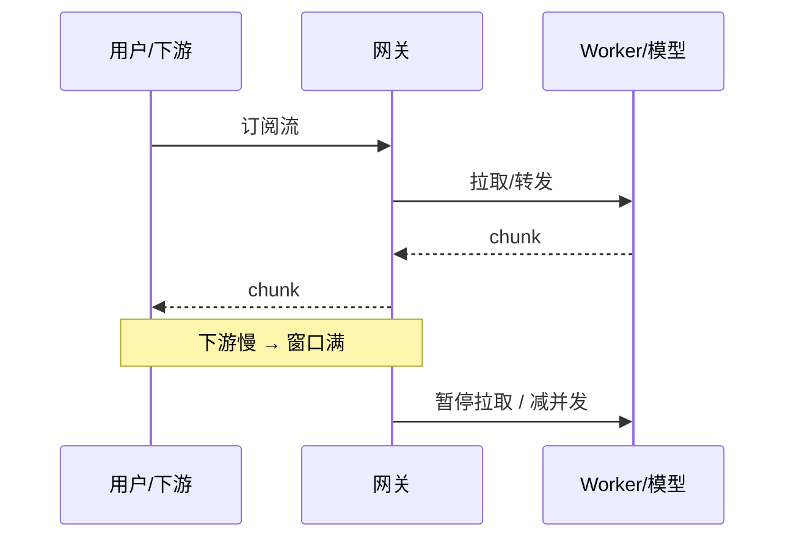

# 03 · 流式与背压

一句话直觉：流式让用户先看见首 token，但管道两端速度不匹配时，**背压**决定你是平滑降载，还是把内存打爆再雪崩。

## 直觉讲解

**流式（streaming）**：生产者边算边推，消费者边收边展示/处理（LLM 的 token 流、日志尾随、消息分区消费）。  
**背压（backpressure）**：下游处理不过来时，向上游传递「慢一点/停一停/丢弃或降级」的信号，使系统在有限界内运行。

无背压的流式 ≈ 无限队列：延迟伪装成吞吐，直到 OOM 或超时风暴。



关键量：

| 概念 | 含义 |
|------|------|
| TTFT | 首 token/首字节时间（体验） |
| 吞吐 | token/s 或 msg/s |
| 缓冲水位 | 队列深度与字节数 |
| 结合点 | 多生产者写入同一消费者时的汇合 |

与「熔断」分工：熔断是失败快停；背压是速度匹配。二者常一起出现。

## 工作示例（数字/场景）

**场景 A：LLM SSE 到前端**

模型 80 token/s，前端因渲染/翻译插件实际消化 20 token/s。若网关无限缓冲：

- 单连接缓冲涨到数 MB  
- 1000 并发 → 内存尖刺  
- 客户端断开后服务端仍生成完（浪费 $）

做法：

1. 读端取消 → 取消上游生成（协作式 cancel）  
2. 有界缓冲（如 N 个 chunk）；满则阻塞拉取或对非关键流降采样  
3. 心跳与空闲超时，避免半开连接占坑  

**场景 B：嵌入流水线**

文档解析 5k 页/分钟，embedding 服务只能 800 页/分钟。无背压：解析临时文件堆满盘。  
有背压：解析阶段按「进行中页数」限流；或队列深度 > 阈值则暂停拉取对象存储。

**场景 C：多租户流式 API**

大客户一条流占满 GPU 连续批。用**按租户的飞行中请求/token 预算**做背压入口；超额返回 429 + Retry-After，而不是让全体 P99 爆炸。

## 面试常问取舍

1. **推模型 vs 拉模型**  
   - 推：实现简单，易过载。  
   - 拉/信用额（reactive streams 思想）：天然背压，复杂度高。  
   - HTTP/2、gRPC、Kafka consumer 各有现成语义——先复用再自造。

2. **阻塞背压 vs 丢弃/降级**  
   - 阻塞：保完整，可能头阻塞。  
   - 丢弃：保存活，需业务允许（指标采样可以，账务流不行）。  
   - LLM 对话：优先取消与限流，而不是偷偷丢 token。

3. **流式是否总该开？**  
   - 交互式聊天：通常要。  
   - 批处理抽取：整段更利于校验与重试。  
   - 工具调用中间状态：流式展示「思考」可能泄暴露系统提示——要产品审查。

4. **背压与重试**  
   - 下游 429 时上游重试必须带抖动，否则背压信号变成重试风暴（见生产轨限流/重试篇）。

## FDE 现场怎么用

- **演示前**：确认取消链路——关掉浏览器 tab，GPU 并发应下降。  
- **SLO**：同时报 TTFT、整段延迟、取消率、队列深度。  
- **合同**：流式 API 写清：心跳、最大缓冲、断开后计费是否停止。  
- **排障口令**：「是慢，还是缓冲在涨？」——看水位比看 CPU 更早发现背压缺失。  
- **与客户基础设施队对齐**：他们的 API Gateway 缓冲与超时，常比你的服务更先掐流。

## 与本库其他篇的链接

- 同轨：[08-并发与GIL](./08-并发与GIL.md)、[10-Big-O真正重要的复杂度](./10-Big-O真正重要的复杂度.md)  
- 生产：[熔断与背压](../04-生产系统设计/09-熔断与背压.md)、[重试指数退避与抖动](../04-生产系统设计/03-重试指数退避与抖动.md)、[限流Rate-Limiting](../04-生产系统设计/05-限流Rate-Limiting.md)、[延迟优化](../04-生产系统设计/07-延迟优化.md)  
- Agent 事件流：[AG-UI协议](../02-检索与Agent/28-AG-UI协议.md)

## 深入：有界设计清单

### 每个流式管道问四问

1. **边界在哪？** 内存/磁盘/飞行中请求数  
2. **满了怎么办？** 阻塞 / 429 / 降级摘要 / 丢弃采样  
3. **取消怎么传？** 从 UI → API → worker → 供应商  
4. **如何观测？** 水位、等待时间、取消后仍产生的 token 数  

### 伪代码水位

```text
buffer = bounded(n)
on_chunk(c):
  if not buffer.try_put(c):
    metrics.backpressure++
    pause_upstream()
on_consume():
  resume_upstream_if_low_watermark()
```

### 与「感觉快」的关系

流式改善的是**感知延迟**，不一定降低总完成时间。若下游工具要等完整 JSON，过早流式反而增加半截解析复杂度——用「结构化完成事件」分段，而不是盲流。

## 课堂小结

流式是体验杠杆；背压是生存杠杆。FDE 交付流式能力时，必须同时交付取消、有界缓冲与水位指标。下一篇回到算法手艺：双指针与滑动窗口——限流与子串类问题的共用骨架。

## 参考与来源

- 原创综述：LLM/数据管道场景中的流式与有界背压（本篇）  
- 本库生产轨「熔断与背压」「限流」篇  
- Reactive Streams / gRPC 流控等公开规范思想（概念层）
