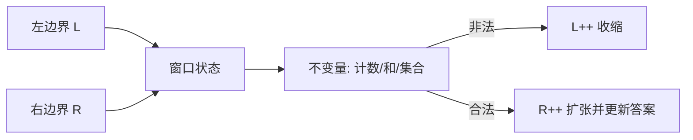

# 04 · 双指针与滑动窗口

一句话直觉：在有序或可单调扩张/收缩的序列上，用两个边界代替暴力二重循环——把 O(n²) 直觉压成 O(n)，并直接映射到限流、去重子串、两数之和等现场题。

## 直觉讲解

**双指针**：两个索引在数组/字符串上协同移动（对撞、同向追赶、快慢指针）。  
**滑动窗口**：同向双指针的特化——维护区间 `[L, R]` 上的不变量（和、字符集、计数），R 扩张、L 收缩，使窗口始终「合法」或逼近最优。

适用信号：

- 序列可按序扫描，最优区间/配对不需要回头乱跳  
- 窗口扩张使某度量单调变「更不合法」，从而可贪心收缩  
- 需要最长/最短满足条件的子段  



与哈希表常搭档：窗口内频数表 O(1) 更新，整体仍 O(n)。

## 工作示例（数字/场景）

**场景 A：两数之和（有序版）**

有序数组找两数之和为 target。对撞指针：`i=0, j=n-1`；和太大 `j--`，太小 `i++`。一次扫描 O(n)。  
无序版则哈希一遍——面试要说清**有序假设从哪来**。

**场景 B：无重复最长子串**

`"abcabcbb"` → 最长 3。窗口维护字符最后位置；遇重复则把 L 跳到重复字符次位置。经典 O(n)。  
现场类比：日志去重「最近窗口内唯一 session」统计。

**场景 C：限流滑动窗口**

固定窗口 100 req/min 会在整点放行尖刺；滑动窗口用时间戳队列或多桶近似：

- 精确：队列存请求时间，弹出 `< now-60s`，长度即计数  
- 近似：若干子桶累加，省内存  

编码轮常从固定窗改滑动窗——不变量是「窗口内计数 ≤ 配额」。

**场景 D：最小覆盖子串 / 采购清单**

窗口要覆盖需求字符多重集。用 `need`/`have` 计数；当 `have==need_types` 时收缩求最短。  
业务类比：从日志流中找「同时包含错误码 A、B、C 的最短时间片」。

## 面试常问取舍

1. **何时不该滑窗？**  
   - 不满足单调性：扩张不一定更接近合法（需回溯/DP）。  
   - 负权「和」类问题常翻车——最大子数组用 Kadane，不是随便滑窗。

2. **双指针 vs 二分**  
   - 单调答案空间可二分「长度」+ 可行性检查；滑窗往往一次过且常数更好。  
   - 口述比较复杂度与实现风险。

3. **快慢指针**  
   - 环检测、中点、删倒数第 k——属于双指针家族，但不变量不同。

4. **实现坑**  
   - 闭开区间搞错；收缩时少更新频数；多字节字符/token 边界（业务串不要假设 ASCII）。

## FDE 现场怎么用

- **编码轮**：先写不变量与例子走表，再写代码；说出 O(n)/O(1) 或 O(k) 额外空间。  
- **生产限流**：滑窗与令牌桶选型见生产轨；本篇练的是**状态更新正确性**。  
- **数据扫描**：大文件找最短满足条件片段——流式滑窗，避免整文件进内存。  
- **与脏数据结合**：窗口统计前先规范化字符；BOM/全角会破坏「唯一字符」假设。

## 与本库其他篇的链接

- 同轨：[05-堆与Top-K](./05-堆与Top-K.md)、[10-Big-O真正重要的复杂度](./10-Big-O真正重要的复杂度.md)、[01-脏数据解析](./01-脏数据解析.md)  
- 生产：[限流Rate-Limiting](../04-生产系统设计/05-限流Rate-Limiting.md)  
- 面试：[编码与Learning轮](../../04-面试通关/编码与Learning轮.md)

## 深入：解题模板

### 同向滑窗骨架

```text
L = 0
init state
for R in 0..n-1:
  expand_with(a[R])
  while state_invalid and L <= R:
    shrink_with(a[L]); L += 1
  update_answer(L, R, state)
```

### 对撞骨架

```text
i, j = 0, n-1
while i < j:
  if ok(i,j): record; move_by_rule()
  else: move_to_restore_monotonicity()
```

### 复杂度口述句

「每个元素最多进窗一次、出窗一次，因此时间 O(n)；窗口状态用哈希表，额外空间 O(Σ)。」

### 练习优先级（FDE 编码）

1. Two Sum（哈希 + 有序双指针对比）  
2. 无重复最长子串  
3. 最小覆盖 / 找所有字母异位词  
4. 滑动窗口最大值（可接单调队列，过渡到下篇堆）  

## 课堂小结

双指针与滑窗是「线性扫描 + 不变量」的手艺：面试提速，生产里映射限流与流式统计。下一篇用堆解决「不需要全排序」的 Top-K 类问题。

## 参考与来源

- 原创综述：双指针/滑窗不变量、限流与编码轮迁移（本篇）  
- 经典算法题型归纳（Two Sum、最长无重复子串、覆盖子串等公开题面）  
- 本库限流与编码轮文档
