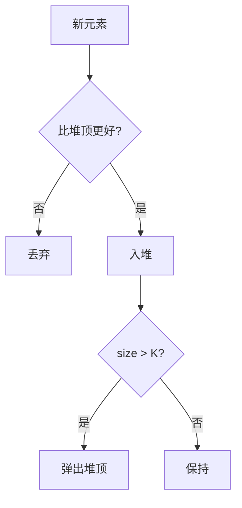

# 05 · 堆与 Top-K

一句话直觉：只要「前 K 名」而不是全排序，就用堆（优先队列）在 O(n log K) 量级拿答案——省时间，更省「为了排序而物化全量」的内存。

## 直觉讲解

**堆（heap）**：近似完全二叉树，满足堆序（父优于子）。常用二叉堆支持 `push`/`pop` 近似 O(log n)，读堆顶 O(1)。  
**Top-K**：从 n 个元素中取最大或最小的 K 个；或频次 Top-K。

关键选型：

| 需求 | 结构 | 复杂度直觉 |
|------|------|------------|
| 全排序 | 快排等 | O(n log n) |
| Top-K 最大 | 大小为 K 的**小顶堆** | O(n log K) |
| Top-K 最小 | 大小为 K 的**大顶堆** | O(n log K) |
| 动态流式 Top-K | 同上，边读边维护 | 内存 O(K) |
| 极小 K 或可分区 | Quickselect | 平均 O(n) |

记忆法：要最大 K 个，堆里留「目前的门槛」——用小顶堆，堆顶是 K 强中最弱，新来的只有更大才挤进门。

## 工作示例（数字/场景）

**场景 A：高频词 Top-K**

词频统计后取前 K。哈希计数 O(n)，再把唯一词推进大小 K 的堆 → O(u log K)。  
面试经典「Top K Frequent Elements」；现场类比：错误码 Top-K、慢查询 Top-K。

**场景 B：多路归并**

K 个有序日志流按时间合并：堆里放每路当前头，弹出最小，再推入该路下一个——O(N log K)。  
FDE 合并多区域导出时常用。

**场景 C：在线「最慢 20 个请求」**

仪表盘不需要保存所有延迟。用大小 20 的小顶堆（存最大的 20）或专用结构；注意：这是近似「当前窗口」，需与时间滑窗结合（堆 + 过期策略或按分钟桶）。

**场景 D：RAG 重排截断**

召回 200，重排模型贵。可先用廉价分数取 Top-50 再精排——第一截断就是 Top-K 思维；K 由延迟预算反推。

## 面试常问取舍

1. **堆 vs Quickselect**  
   - Quickselect 平均更快但不稳，最坏 O(n²)；要确定性延迟时堆更可控。  
   - 需要「有序的 Top-K」时，堆弹出可得序，select 还需再排 K。

2. **堆 vs 有序树 / SortedSet**  
   - 需任意删除中间元素、按 key 更新：树或「懒删除堆」。  
   - 纯 Top-K：二叉堆最简单。

3. **大顶堆小顶堆搞反**  
   - 写前用 5 个数字手走一遍；这是高频口误。

4. **K ≥ n**  
   - 直接全量，别死套堆。

## FDE 现场怎么用

- **编码轮**：先说清「要最大还是最小 K」，再选堆类型；边界：K=1、K=n、空输入。  
- **可观测**：Top-K 错误与 Top-K 租户消耗，是排障入口。  
- **成本控制**：重排/LLM 前的候选截断必须有 K 与理由（延迟/费用）。  
- **陷阱**：全局 Top-K 掩盖长尾租户——常要「每租户 Top-K」或分层采样。

## 与本库其他篇的链接

- 同轨：[04-双指针与滑动窗口](./04-双指针与滑动窗口.md)、[07-缓存与淘汰](./07-缓存与淘汰.md)、[10-Big-O真正重要的复杂度](./10-Big-O真正重要的复杂度.md)  
- 检索：[重排与两阶段检索](../02-检索与Agent/05-重排与两阶段检索.md)  
- 面试：[编码与Learning轮](../../04-面试通关/编码与Learning轮.md)

## 深入：实现细节与变体

### 语言差异

- Python：`heapq` 是小顶堆；要大顶堆可存负值或元组自定义。  
- 不要在面试里假设存在「现成 Top-K API」而不讲原理。

### 带更新的频率堆

元素频次变化时，二元组 `(freq, item)` 直接改堆中值代价高。常用：

- 懒更新：弹出时发现频次过期则丢弃  
- 或桶排序（频次范围小，O(n)）  

频次 Top-K 且 `freq ≤ n` 时，桶排序常比堆更干净。

### 复杂度对照口述

「n=1e7，K=20：全排序约 n log n 次比较级；堆约 n log 20。差的是常数与内存局部性，但算法量级叙事足够面试；生产再补基准。」

### 与中位数

双堆（最大堆+最小堆）维护动态中位数——属于堆的进阶组合拳，了解即可，现场少见硬写。

## 课堂小结

Top-K 是「够用的排序」。堆让你在流式与海量场景保住内存与尾延迟。下一篇把「依赖图/任务序」交给图遍历与拓扑排序。

## 练习题口述稿（3 题）

### Top-K 高频

「先哈希计数 O(n)，再用大小为 K 的小顶堆维护当前 Top-K，总体 O(n + u log K)。若频次范围 ≤ n，也可用桶排序 O(n)。边界：K=1、全相同、空输入。」

### 数据流第 K 大

「维护大小 K 的小顶堆；每来一个数，若更大则替换堆顶。空间 O(K)，适合流式。」

### 合并 K 个有序表

「堆中放每路当前头结点（值、路编号、下标），弹出最小再推入后继，O(N log K)。」

把这三套话在白板上各走一遍 5 个数字，比只背复杂度更稳。

## 参考与来源

- 原创综述：Top-K 选型、多路归并与 FDE 观测截断（本篇）  
- 经典堆与 Top-K 题型（公开题面）  
- 本库重排与编码轮文档
