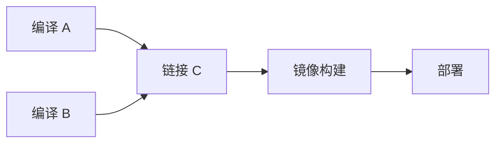

# 06 · 图遍历与拓扑排序

一句话直觉：把对象变成点、关系变成边之后，BFS/DFS 解决「通达与分层」，拓扑排序解决「有依赖时谁先谁后」——岛屿、课程表、流水线调度都是同一套骨架。

## 直觉讲解

**图**：`G=(V,E)`。稠密/稀疏决定用邻接矩阵还是邻接表。  
**BFS**：队列，按层扩张——最短路（无权）、层级、连通分量。  
**DFS**：栈/递归，深挖——环检测、路径存在、连通、拓扑的一种实现。  
**拓扑排序**：有向无环图（DAG）上的线性序，使每条边 `u→v` 都有 u 在 v 前。存在环 ⇒ 无拓扑序。



FDE 映射：

| 问题 | 图模型 |
|------|--------|
| 岛屿数量 | 网格四联通 |
| 权限/组继承 | 有向图可达 |
| dbt/Airflow 任务 | DAG 拓扑 |
| 包依赖 / 工作流 | 拓扑 + 环报错 |
| Agent 工具调用链 | 有向图；慎防环 |

## 工作示例（数字/场景）

**场景 A：岛屿数量**

`'1'` 陆地 `'0'` 水。每次撞见陆地就 DFS/BFS 淹没整岛，计数 +1。时间 O(rows·cols)。  
面试高频；要点是**访问标记**防重入。

**场景 B：课程表 / 任务能否完成**

`n` 门课，先修关系。Kahn 算法：入度为 0 入队，删边减入度；若出队数 `< n` 则有环。  
现场：数据管道「表 A 依赖表 B」循环依赖必须在部署前失败，而不是跑到半夜。

**场景 C：多区域配置展开**

服务依赖配置中心 → 密钥 → 模型端点。画有向图做拓扑，得到启动顺序；环则启动死锁。Walking Skeleton 第一周就该画这张图。

**场景 D：网格最短步数**

二进制迷宫最短路用 BFS，不要 DFS 找最短（除非加额外结构）。口述「无权最短路 = BFS」。

## 面试常问取舍

1. **BFS vs DFS**  
   - 最短层数、层级遍历：BFS。  
   - 路径存在、拓扑（DFS 后序）、内存（深窄图）：DFS。  
   - 递归深度：Python 默认递归限；生产偏显式栈。

2. **Kahn vs DFS 拓扑**  
   - Kahn 更直观产出「可并行的一层」。  
   - DFS 拓扑注意「访问中」三色标记检环。

3. **隐式图**  
   - 网格、状态转移（单词梯）不必先物化全部边。  

4. **并查集何时替 BFS**  
   - 只关心连通性、大量合并查询：并查集；需要路径本身：遍历。

## FDE 现场怎么用

- **编码轮**：先定义节点与边的含义，再选遍历；举例走一层。  
- **交付**：把部署/迁移依赖画成 DAG，环是 P0。  
- **Agent**：工具调用若允许互相触发，要深度/扇出上限——图上的「爆炸半径」。  
- **事故**：级联故障分析 = 依赖图上的可达闭包。

## 与本库其他篇的链接

- 同轨：[05-堆与Top-K](./05-堆与Top-K.md)、[10-Big-O真正重要的复杂度](./10-Big-O真正重要的复杂度.md)  
- 生产：[Walking-Skeleton瘦切片](../04-生产系统设计/11-Walking-Skeleton瘦切片.md)、[消息队列与PubSub](../04-生产系统设计/15-消息队列与PubSub.md)  
- Agent：[多Agent编排](../02-检索与Agent/09-多Agent编排.md)  
- 面试：[Decomposition拆解面](../../04-面试通关/Decomposition拆解面.md)

## 深入：模板与复杂度

### BFS 模板

```text
q = deque(starts); mark starts
while q:
  u = q.popleft()
  for v in neighbors(u):
    if not seen[v]:
      seen[v]=True; parent[v]=u; q.append(v)
```

### Kahn 拓扑

```text
indeg[v] = ...
q = {v | indeg[v]==0}
order = []
while q:
  u = pop; order.append(u)
  for v in outs[u]:
    indeg[v]-=1
    if indeg[v]==0: q.push(v)
if len(order) < |V|: cycle
```

### 复杂度

邻接表：`O(|V|+|E|)`。面试务必问清是否有重边、自环、双向。

### 实践坑

- 网格越界；对角连通还是四连通要问清。  
- 拓扑唯一性：入度 0 多个时序不唯一——并行调度要说明。  
- 大图 DFS 递归爆栈。

## 课堂小结

图论在 FDE 不是竞赛偏题，而是依赖、连通与调度的语言。能画图、能检环、能分层，现场与面试通用。下一篇讲缓存与淘汰——系统题与编码题的交汇点。

## 参考与来源

- 原创综述：BFS/DFS/拓扑在编码与交付依赖中的用法（本篇）  
- 经典题：岛屿数量、课程表、拓扑排序（公开题面）  
- 本库 Walking Skeleton 与 Decomposition 文档
