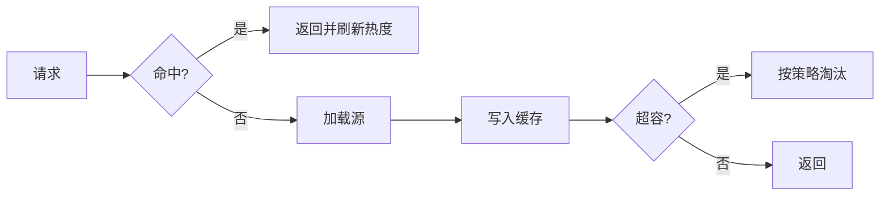

# 07 · 缓存与淘汰

一句话直觉：缓存用空间换时间；没有**淘汰策略与失效正确性**，缓存只是「会撒谎的加速器」。

## 直觉讲解

**缓存**：把昂贵计算结果放近处（内存、CDN、Prompt 缓存）。  
**淘汰**：容量满时踢谁——LRU / LFU / FIFO / TTL / 随机等。  
**失效**：源数据变了如何保证读到新值（或明确的旧值窗口）。

编码面试常写 **LRU**：`O(1)` get/put，哈希表 + 双向链表（或语言自带 `OrderedDict` 思路）。

关键指标：命中率、过期率、陈旧读取、填充延迟、惊群（cache stampede）。

## 工作示例（数字/场景）

**场景 A：手写 LRU**

容量 2：`put 1; put 2; get 1; put 3` → 淘汰 2；`get 2` 未命中。  
链表维护新旧顺序，哈希指向节点。细节：更新已存在 key 要移到队首。

**场景 B：嵌入向量缓存**

相同 chunk 文本重复嵌入。键 = `model_version + hash(text)`。换模型必须换命名空间（见 Embedding 漂移篇）。淘汰用 LRU + TTL；命中率从 20% 到 70% 可显著降费用。

**场景 C：语义缓存**

用户问句向量近则复用答案——省钱但有错答放大风险。需：相似度阈值、租户隔离、失效与审计。比 LRU 更「产品」。

**场景 D：惊群**

热点 key 过期，1k 请求同时打穿到 LLM。做法：单飞（singleflight）、软过期 + 异步刷新、概率性提前过期。

## 面试常问取舍

1. **LRU vs LFU**  
   - LRU：实现常见，抗「一次扫描污染」弱于 LFU。  
   - LFU：要老化策略，否则历史热点占坑。  
   - 扫描型负载（一次性全表）会毁掉 LRU——可加「扫描抵抗」或分段缓存。

2. **TTL vs 事件失效**  
   - TTL 简单，有陈旧窗口。  
   - 事件失效准，要消息可靠与订阅面。  
   - 权限类缓存倾向短 TTL + 主动失效。

3. **正确性 vs 命中率**  
   - 财务/权限：宁可低命中。  
   - 推荐文案：可接受短陈旧。

4. **本地缓存 vs 分布式**  
   - 本地快但不一致；分布式一致成本高。  
   - 多实例 LRU 各说各话——改配置后的「看见旧 Prompt」是典型事故。

## FDE 现场怎么用

- **编码轮**：讲清结构不变量；分析 get/put 皆 O(1)。  
- **设计评审**：每个缓存写「键、值、TTL、淘汰、失效、租户维度、穿透保护」。  
- **换模型/换提示**：版本进键；禁止只靠人工清缓存。  
- **演示翻车点**：缓存了错误答案——救援时先「旁路缓存」再查根因（见客户面 Demo 救援篇）。

## 与本库其他篇的链接

- 同轨：[05-堆与Top-K](./05-堆与Top-K.md)、[03-流式与背压](./03-流式与背压.md)  
- LLM：[Prompt缓存与语义缓存](../01-LLM与GenAI基础/28-Prompt缓存与语义缓存.md)  
- 检索：[Embedding版本与漂移](../02-检索与Agent/24-Embedding版本与漂移.md)、[索引新鲜度与陈旧窗口](../02-检索与Agent/25-索引新鲜度与陈旧窗口.md)  
- 生产：[幂等Idempotency](../04-生产系统设计/04-幂等Idempotency.md)

## 深入：LRU 实现要点与生产变体

### O(1) LRU 组件

| 组件 | 职责 |
|------|------|
| `dict[key→node]` | 定位 |
| 双向链表 | 头=最新，尾=最旧（约定写清） |
| 容量计数 | 超额弹尾 |

### 变体

- **LRU-K / 分段 LRU**：Redis 等用更抗污染策略。  
- **W-TinyLFU**：高命中逼近，实现重——了解即可。  
- **写穿 / 写回**：写路径一致性不同；LLM 结果缓存多为写旁路。

### 键设计错误

- 键不含 `tenant_id` → 串数据（安全事故）。  
- 键不含模型/提示版本 → 静默质量回归。  
- 键用完整原文过大 → 用哈希并处理碰撞策略。

### 穿透 / 击穿 / 雪崩（口述三分）

- 穿透：查不存在的键打到源 → 布隆/空值短 TTL。  
- 击穿：热点过期 → 单飞。  
- 雪崩：大量同刻过期 → TTL 抖动。

## 课堂小结

缓存题考数据结构；缓存工程考失效与隔离。FDE 两者都要：面试写 LRU，现场写「版本化键 + 陈旧窗口」。下一篇进入 Python 现场常见的并发与 GIL。

## 一周落地节奏（缓存专项）

| 日 | 动作 |
|----|------|
| D1 | 列出全部缓存键与租户/版本维度 |
| D2 | 定义 TTL、淘汰、失效事件 |
| D3 | 加单飞与空值保护；打命中率指标 |
| D4 | 故障演练：错误写入后的旁路与双删 |
| D5 | 写入 Runbook：清缓存命令与责任人 |

客户演示前一天，刻意做一次「错误答案进缓存」演练，确认救援话术与旁路开关可用（见客户面 Demo 救援篇）。

## 参考与来源

- 原创综述：LRU/淘汰/失效与 AI 缓存键设计（本篇）  
- 经典 LRU Cache 题面与操作系统页置换思想  
- 本库 Prompt/语义缓存与 Embedding 版本篇
