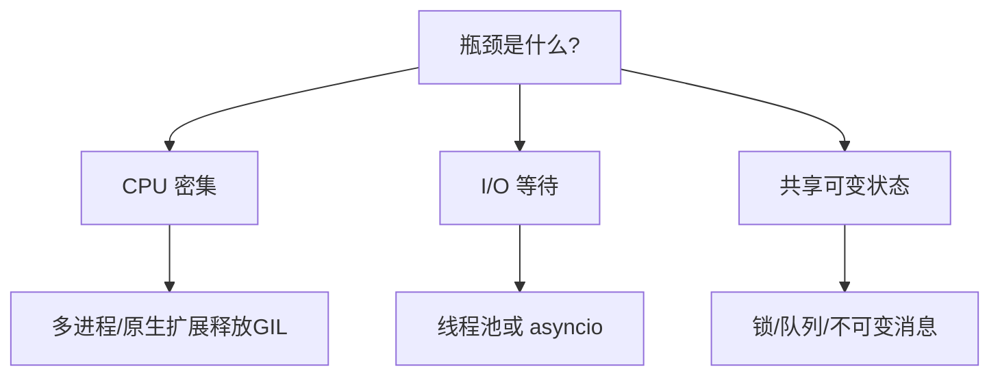

# 08 · 并发与 GIL

一句话直觉：Python 的 GIL 让多线程**几乎不能加速 CPU 密集**，但 I/O 等待仍可重叠；选线程、进程还是 asyncio，先问瓶颈在 CPU、在等待，还是在共享状态正确性。

## 直觉讲解

**并发（concurrency）**：结构上能交错推进多个任务。  
**并行（parallelism）**：同一时刻真多核执行。  
**GIL（Global Interpreter Lock）**：CPython 中保证同一时刻只有一个线程执行字节码的互斥锁。结果：

| 负载 | 多线程 | 多进程 | asyncio |
|------|--------|--------|---------|
| CPU 密集（纯 Python） | 难加速 | 可并行 | 不适合 |
| I/O 等待（HTTP/DB） | 常有效 | 有效但重 | 高并发连接优 |
| 混合 | 拆分：进程算、异步 I/O | 按边界 | 事件循环 + 线程池卸 CPU |

GIL 不等于「无线程安全」：结构共享仍要锁；GIL 只保护解释器内部一致性，不保护你的业务不变量。

## 工作示例（数字/场景）

**场景 A：批量嵌入 1 万段文本**

纯串行：假设每段 50ms RTT → 约 500s。  
`ThreadPoolExecutor(max_workers=32)`：主要等网络，吞吐可近线性到限流墙。  
若本地用 ONNX CPU 推理：多线程可能几乎不加快，应多进程或批量化到向量化内核（C/CUDA 常释放 GIL）。

**场景 B：请求被处理两遍**

面试/事故题：Python worker 在「至少一次」投递下，超时重试导致重复副作用。  
根因常是：非幂等处理 + 并发 ack。解法：幂等键、事务外移副作用、可见「处理中」状态——不是「加个线程锁」就结束。

**场景 C：asyncio + 阻塞库**

在 async 路由里直接 `requests.get` 或重 CPU 解析 → 堵死事件循环，全站尾延迟爆炸。  
卸到 `asyncio.to_thread` 或进程池；或换原生 async 驱动。

**场景 D：客户 VPC 小机器**

4 核盒子上 `multiprocessing` 起 16 个重模型进程 → 内存挤兑比 GIL 更致命。并发度要按 **RAM/连接数/供应商 RPM** 反推，不是按「越大越好」。

## 面试常问取舍

1. **为什么有 GIL？**  
   - 简化 CPython 对象管理与 C 扩展生态历史选择。  
   - 口述到「影响」比背历史得分高：CPU 多线程不扩展。

2. **线程安全吗？**  
   - 操作原子性：单次字节码≠业务原子。  
   - `dict` 并发写仍可坏；用队列做所有权转移更简单。

3. **asyncio 能破 GIL 吗？**  
   - 不能。它用单线程协作式切换提高 I/O 利用率。

4. **自由线程 Python（无 GIL 实验）**  
   - 知道生态在变即可；客户现场版本与扩展兼容性要实测，别在交付里赌。

## FDE 现场怎么用

- **先测**：火焰图/cProfile 分清 CPU vs wait。  
- **默认 I/O**：线程池或 asyncio；**默认 CPU**：进程、批处理、把热区下沉到矢量库/推理服务。  
- **共享状态**：优先消息队列与不可变事件，少共享可变内存。  
- **与限流/背压**：并发度是背压旋钮——见流式篇与生产限流篇。  
- **编码轮**：若问「多线程加速解析 JSON」——先问数据是否 CPU 界，再答 GIL。

## 与本库其他篇的链接

- 同轨：[03-流式与背压](./03-流式与背压.md)、[02-可测试性与依赖注入](./02-可测试性与依赖注入.md)  
- 生产：[幂等Idempotency](../04-生产系统设计/04-幂等Idempotency.md)、[限流Rate-Limiting](../04-生产系统设计/05-限流Rate-Limiting.md)、[消息队列与PubSub](../04-生产系统设计/15-消息队列与PubSub.md)  
- 面试：[编码与Learning轮](../../04-面试通关/编码与Learning轮.md)

## 深入：选型清单与坑

### 决策表（实用）

1. 是否释放 GIL 的原生代码占主导？→ 线程可能真并行。  
2. 任务是否可无共享拆分？→ 进程池 + 结果队列。  
3. 连接数是否上万且几乎全 wait？→ asyncio。  
4. 是否必须与同步 SDK 共存？→ 小线程池隔离，勿污染事件循环。

### 锁的层级

- 太粗：伪串行。  
- 太细：死锁与复杂度。  
- 中庸：把临界区缩到更新共享结构几行；I/O 不进锁。

### 测试并发

- 单测注入时钟与假 I/O（可测试性篇）。  
- 用压力测「重复处理」「丢失 ack」——比睡 0.1 秒的 flaky 测试有用。

### 口述 30 秒版

「CPython GIL 限制 CPU 密集多线程并行；I/O 仍可用线程或 asyncio 重叠等待。共享可变状态要锁或队列。我会先 profiling 再选进程/线程/异步，并把副作用做成幂等。」

## 课堂小结

并发题得分点是**瓶颈分类 + 正确性**，不是背名词。GIL 是 CPython 约束，不是业务锁。下一篇进入数值稳定性——softmax/日志概率里静默 NaN 的来源。

## 现场容量估算草表

假设：每请求 200ms 纯等待供应商，CPU 本地 5ms。

- 单线程大约 5 QPS 量级（受等待主导）  
- 线程池 40：理论可接近供应商限流前的数十 QPS  
- 若本地解析改为 80ms CPU：线程池收益骤降，应把解析下沉或多进程  

先填这张表再争「要不要上 asyncio」，争论质量会高一个数量级。

## 与消息队列的分界

「线程内并行」解决单进程利用率；「队列」解决峰值削峰与重试边界。重复处理问题优先看投递语义与幂等，而不是先加锁。

## 参考与来源

- 原创综述：FDE 场景下 GIL/线程/进程/asyncio 选型（本篇）  
- CPython GIL 公开文档与讨论（概念层）  
- 本库幂等、限流与背压篇
