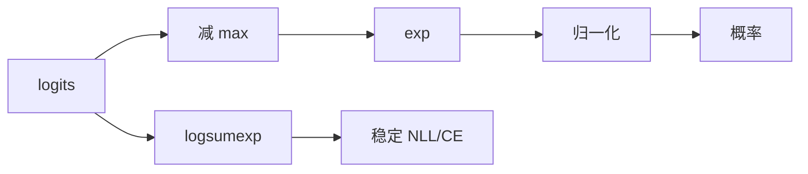

# 09 · 数值稳定性

一句话直觉：同一条数学式，按不同顺序算，在浮点里可以差出 NaN/Inf 或「全零梯度」——稳定性是让概率、损失与归一化在有限精度下仍可信。

## 直觉讲解

浮点（IEEE754）有有限位有效数字。大正数+小数值会吞掉小数；`exp(大数)` 上溢；两近数相减消掉有效位。ML/LLM 里最常见的坑是 **softmax / log-sum-exp / 交叉熵** 的朴素实现。

**不稳定 softmax：**

```text
softmax(x)_i = exp(x_i) / sum_j exp(x_j)
```

当 `x_i=1000`，`exp` 直接 Inf。

**稳定写法：**先减最大值

```text
m = max(x)
softmax(x)_i = exp(x_i - m) / sum_j exp(x_j - m)
```

数学等价，数值可行。同理，`logsumexp(x) = m + log(sum exp(x-m))`。



| 症状 | 可能原因 |
|------|----------|
| 概率全 NaN | exp 上溢/0/0 |
| 一 spiky 特别尖 | 温度过低 + 未稳定 |
| loss=Inf | log(0) 未加 clamp |
| 训练抖 | 学习率×未归一特征 |

## 工作示例（数字/场景）

**场景 A：手写 softmax 面试**

输入 `[1000, 1001, 1002]`。朴素全 Inf；稳定版减 1002 后正常，且最大项概率接近 1。  
口述要写清「减 max 不改变 softmax」。

**场景 B：重排分数熔断**

交叉编码器输出超大 logits，下游温度缩放时爆炸。统一走 `log_softmax` API，禁止手写 `log(softmax(x))`（两段误差更大）。

**场景 C：检索分数融合**

BM25 与向量分数量纲差 1e3。直接加 → 一方吞掉另一方。应校准（如 min-max / z-score / learned fusion），这是「数值」也是「度量」。

**场景 D：累计乘概率**

长序列把概率连乘 → 下溢到 0。改用 log 域求和；比较路径用 log 概率。Agent 轨迹打分同理。

## 面试常问取舍

1. **减 max 是否总安全？**  
   - 对 softmax/logsumexp 是标准。  
   - 注意全 `-inf` 掩码位置：要在减 max 与归一化时正确屏蔽。

2. **float16 / bfloat16**  
   - 更易溢/更噪。推理常用混合精度：敏感归约用 fp32 累加。  
   - 「量化后结果飘」先查是否在低精度里做了不稳定归约。

3. **加 epsilon**  
   - `log(p+1e-12)` 是工程补丁；更好是避免产生 0 概率的路径（mask）。  
   - epsilon 过大会偏置概率。

4. **与温度**  
   - `softmax(x/T)`：T→0 更尖，更易数值问题；稳定实现仍必要。

## FDE 现场怎么用

- **评测脚本**：断言无 NaN、概率和为 1（容差）、掩码位为 0。  
- **日志**：打 logits 的 min/max/百分位，比只打 loss 更容易早发现爆炸。  
- **融合分数**：先标定再融合；A/B 时记录版本。  
- **客户报表**：百分比与比率用整数基点或 Decimal，避免「0.1+0.2」钱款笑话。

## 与本库其他篇的链接

- 同轨：[10-Big-O真正重要的复杂度](./10-Big-O真正重要的复杂度.md)、[01-脏数据解析](./01-脏数据解析.md)  
- LLM：[Temperature-Top-p与采样](../01-LLM与GenAI基础/07-Temperature-Top-p与采样.md)  
- 评测：[信息论Entropy-CrossEntropy-KL-Perplexity](../03-评测与ML基础/01-信息论Entropy-CrossEntropy-KL-Perplexity.md)、[损失函数](../03-评测与ML基础/16-损失函数.md)  
- 检索：[混合检索Hybrid-Search](../02-检索与Agent/03-混合检索Hybrid-Search.md)

## 深入：常用稳定恒等式

### log-softmax

```text
log_softmax(x_i) = x_i - logsumexp(x)
```

一次算对，供 NLL 使用。

### 带 mask 的注意力分数

对非法位置填 `-inf`（或极负），再稳定 softmax；检查「整行被 mask」时的退化策略（防止 0/0）。

### 条件数直觉

算法对输入微扰是否放大误差。归一化、中心化、避免灾难性抵消，都是降条件数的工程手段。

### 小检查清单

- [ ] 概率是否在 log 域累计？  
- [ ] softmax 是否减 max / 用官方 API？  
- [ ] fp16 归约是否提到 fp32？  
- [ ] 不同分数是否同量纲？  
- [ ] 单元测试含极端 logits（±1e3、全相等、带 -inf mask）  

## 课堂小结

数值稳定性是「数学上对、机器上也可算」。FDE 不推导浮点误差界，但必须能写出稳定 softmax，并能诊断 NaN 从哪一层冒泡。下一篇收束：Big-O 里真正影响交付的复杂度叙事。

## 参考与来源

- 原创综述：softmax/logsumexp、分数融合与现场 NaN 排障（本篇）  
- 数值稳定 softmax / log-sum-exp 经典技巧（教材与框架实现共识）  
- 本库信息论与采样相关篇
