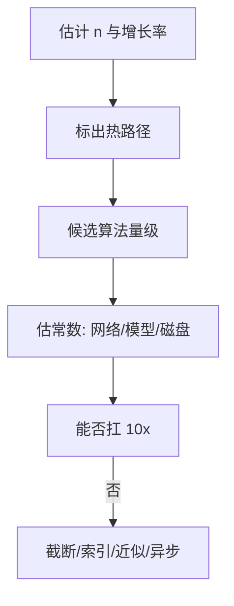

# 10 · Big-O 真正重要的复杂度

一句话直觉：Big-O 不是背诵题，而是**容量规划与算法选型的口语**——在 FDE 场景里，真正要命的是数据规模涨 10×/100× 时哪一项先炸：时间、内存、还是尾延迟。

## 直觉讲解

**Big-O**：上界量级，忽略常数与低阶项，描述输入规模 `n` 增长时资源怎么长。  
「真正重要」指：现场决策只关心**会改变方案**的那几档，而不是纠结 `O(2n)` vs `O(n)`。

| 量级 | 体感（n=1e6 级） | 常见动作 |
|------|------------------|----------|
| O(1) / O(log n) | 字典、堆顶、二分 | 热路径可接受 |
| O(n) | 一趟扫描 | 默认目标 |
| O(n log n) | 排序、堆构建感 | 通常可接受 |
| O(n²) | 双层循环 | n>1e4~1e5 危险 |
| O(2^n)/阶乘 | 枚举 | 仅微小 n 或剪枝 |

还要会说 **空间 Big-O** 与 **尾延迟**：平均 O(n) 但偶发 O(n²)（如哈希退化、Quickselect 最坏）会烧错误预算。

地图里编码手艺强调的结构（滑窗、堆、拓扑、LRU）都是把常见 `O(n²)` 直觉降到 `O(n)`/`O(n log K)` 的工具箱；本篇把它们收成**决策语言**。

## 工作示例（数字/场景）

**场景 A：两两比相似度**

`n=2e4` 段文本，朴素两两余弦 → ~2e8 次向量点积。若每秒 1e7 次，也要数十秒级且随 n² 爆。  
改：ANN / 倒排候选 + 重排（检索轨）——把「全配对」变成「近似 Top-K」。

**场景 B：每次请求扫描全库**

权限过滤若对 500 万 chunk 线性扫，QPS=20 就不可活。复杂度叙事：必须把过滤推进索引侧或预裁剪租户分片——O(全库) 不进热路径。

**场景 C：编码轮口述**

「滑动窗口最长无重复子串 O(n) 时间 O(Σ) 空间；若暴力 O(n²)。n 到 1e5 必须线性。」  
分数来自：**约束规模 → 选量级 → 写不变量**。

**场景 D：常数因子骗过 Big-O**

一次 `O(n)` 但每次循环打 LLM → 真实成本是 `O(n)·$`。量级分析要包含**外部调用**这个「超级常数」。

## 面试常问取舍

1. **平均 vs 最坏**  
   - 哈希平均 O(1)，最坏 O(n)；安全场景防退化。  
   - 延迟 SLO 看 P99，不是平均复杂度童话。

2. **预处理换查询**  
   - 建索引 O(n log n) 或更贵，查询 O(log n)/O(1)。  
   - 写少读多时划算；颠倒则亏。

3. **近似算法**  
   - ANN、HyperLogLog、布隆：用误差换量级跳跃。  
   - 口述误差如何进产品（多召回/漏计）。

4. **并行能否改善 Big-O？**  
   - 通常改善墙钟，不降工作总量；还加通信成本。  
   - GIL 篇：并行性还受运行时约束。

## FDE 现场怎么用

- **立项**：写下「今天 n、一年后 n、热路径每次请求碰多少元素」。  
- **设计评审必问**：这里是 O(n) 还是 O(n²)？n 是用户数、token、文档数还是边数？  
- **POC 陷阱**：笔记本 n=1e3 的 O(n²) 到生产 n=1e6 会沉默死亡——要在试点验收写规模假设（客户面轨）。  
- **优化顺序**：先降量级，再抠常数；先消除热路径全表扫，再谈微优化。

## 与本库其他篇的链接

- 同轨：[04-双指针与滑动窗口](./04-双指针与滑动窗口.md)、[05-堆与Top-K](./05-堆与Top-K.md)、[06-图遍历与拓扑排序](./06-图遍历与拓扑排序.md)、[07-缓存与淘汰](./07-缓存与淘汰.md)  
- 检索：[ANN近似最近邻](../02-检索与Agent/06-ANN近似最近邻.md)  
- 生产：[延迟优化](../04-生产系统设计/07-延迟优化.md)、[AI成本与单位经济](../04-生产系统设计/02-AI成本与单位经济.md)  
- 面试：[编码与Learning轮](../../04-面试通关/编码与Learning轮.md)、[Decomposition拆解面](../../04-面试通关/Decomposition拆解面.md)

## 深入：怎么在白板上「算得像工程师」

### 三步口述法

1. **定义 n**：一个符号只代表一种规模。  
2. **数循环与结构**：哈希/堆/排序各贡献什么。  
3. **对照预算**：在目标 QPS/延迟下是否可行；不行说清改哪个量级。

### 常见静默 O(n²)

- 在循环里 `list` 做 `in`（链表式扫描）。  
- 字符串反复 `+=` 误用导致的平方行为（语言相关）。  
- 对每个查询线性扫全库权限。  
- 图算法用邻接矩阵稠密假设处理稀疏图。

### 内存量级

`O(n)` 个浮点向量 × 维数 × 4/8 字节——ANN 内存墙往往先于 CPU 墙。复杂度分析要含「放得下吗」。

### 与单位经济联动

复杂度 ↓ 不一定成本 ↓（例如更复杂模型）。把「次/请求」与「$/请求」写在同一张表。

## 课堂小结

Big-O 是 FDE 的风险语言：指出哪段在规模化时先死，并给出降阶手段（滑窗、堆、索引、近似、缓存）。本轨编码手艺到此收束；可转到客户面手艺，把技术取舍讲给非工程师。

## 编码轮速查：结构 → 量级

| 结构/手法 | 典型时间 | 何时用 |
|-----------|----------|--------|
| 哈希表 | 平均 O(1) | 查找/计数 |
| 双指针/滑窗 | O(n) | 子段不变量 |
| 堆 Top-K | O(n log K) | 只要前 K |
| 排序 | O(n log n) | 需要全序 |
| BFS/DFS | O(V+E) | 图/网格 |
| 朴素双重循环 | O(n²) | 仅小 n |

面试官要听的是你**如何排除 O(n²)**，以及 n 的现实取值，而不是背诵表本身。

## 参考与来源

- 原创综述：面向交付与面试的复杂度决策（本篇）  
- 标准算法分析量级共识（教材级）  
- 本库 ANN、成本与编码轮文档  
- 公开概念地图中的编码手艺条目（脏解析、可测、流式、滑窗、堆、图、缓存、GIL、数值稳定）之收束篇
