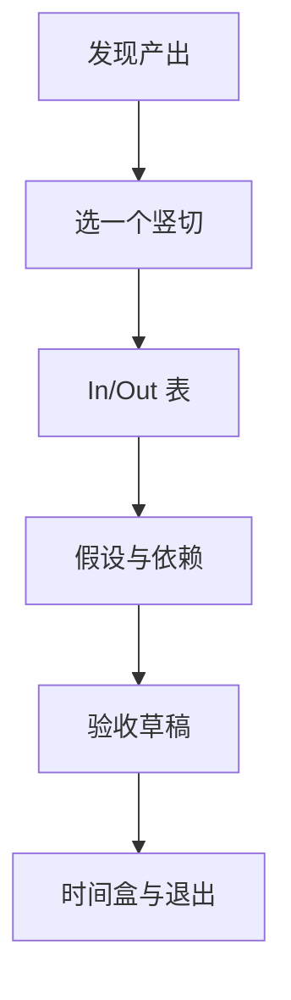

# 02 · 模糊问题定范围 Scoping

一句话直觉：范围不是功能列表，而是**边界合同**——写清做/不做、假设、接口与退出条件，模糊项目才不会靠情绪扩写。

## 直觉讲解

**Scoping（定范围）**把已发现的问题压成可交付切片：用户、场景、数据、集成面、成功标准、非目标、风险。模糊不是敌人；**无边界的模糊**才是。

好范围具备：

| 要素 | 作用 |
|------|------|
| 用户与场景 | 防止「全员平台」空想 |
| In / Out | 防止暗改合同 |
| 假设 | 可被下周证伪 |
| 依赖与接口 | 暴露客户侧责任 |
| 验收 | 与试点篇衔接 |
| 时间盒 | 强迫取舍 |



与 Walking Skeleton 一致：先端到端窄路径，再加宽。

## 工作示例（数字/场景）

**场景 A：从「企业知识库」收到窄**

过宽：所有 SharePoint + 邮件 + 票务。  
范围 v1：

- In：政策 PDF 指定站点 2 个库；只读；引用回答；人工反馈按钮  
- Out：邮件、自动改文档、多语言、移动端  
- 假设：PDF 可解析达 90% 页可读（用样例集验证）  
- 时间盒：4 周试点  

**场景 B：范围谈判话术**

客户：能不能顺便把工单系统也接了？  
你：可以进 Out→Parked；否则试点从「验证检索可信」变成「半年集成」。若业务必须，则换验收指标与工期——**显式交换**，不默默答应。

**场景 C：面试 Decomposition「城市降 911 响应」**

先定：优化的是派单、路由、还是报到？数据是否存在？四周能验证哪条因果？——这就是 scoping 口述。

## 面试常问取舍

1. **说不 vs 丢单**  
   - 说不的是「此刻不做」；给 Parked 与条件触发。  
   - 客户感谢的是避免失败项目（行为面常见题）。

2. **范围写多细**  
   - 细到接口负责人与样例数据交付日；不必细到每个按钮像素。

3. **技术范围 vs 组织范围**  
   - 常缺的是「谁周几给权限」；写进依赖。

4. **固定范围 vs 敏捷**  
   - 试点时间盒内范围硬；学习通过「假设验证」进入下一盒，而不是盒内无限加戏。

## FDE 现场怎么用

- **产出模板**：一页 Scope（In/Out/假设/依赖/验收/时间盒）。  
- **变更流程**：任何 In 增加 = 同步改验收或延期——当场说清。  
- **对齐销售**：合同附件挂 Scope 版本号。  
- **站会**：只问「范围是否被打穿」。

## 与本库其他篇的链接

- 同轨：[01-需求发现Requirements-Discovery](./01-需求发现Requirements-Discovery.md)、[03-试点验收标准Pilot-Acceptance](./03-试点验收标准Pilot-Acceptance.md)、[05-部署决策权Deployment-Decision-Rights](./05-部署决策权Deployment-Decision-Rights.md)  
- 交付：[POC到生产](../../02-交付方法论/POC到生产.md)、[反模式与踩坑](../../02-交付方法论/反模式与踩坑.md)  
- 生产概念：[Walking-Skeleton瘦切片](../04-生产系统设计/11-Walking-Skeleton瘦切片.md)、[从POC到生产](../04-生产系统设计/01-从POC到生产.md)  
- 面试：[Decomposition拆解面](../../04-面试通关/Decomposition拆解面.md)、[客户模拟操练](../../04-面试通关/客户模拟操练.md)

## 深入：In/Out 表示例

| 主题 | In | Out / Parked |
|------|----|--------------|
| 用户 | 一线坐席 30 人 | 全公司自助 |
| 数据 | 产品库 A/B | 邮件归档 |
| 动作 | 检索+起草 | 自动发送 |
| 部署 | 客户 VPC 只读 | 气隙 |
| 语言 | 中文 | 多语 |

### 假设登记

```text
A1: 周检索量 < 5e4 — 验证：看日志一周
A2: 法务接受引用片段外发到 LLM 供应商 — 验证：书面确认
A3: 平均 PDF 可解析 — 验证：50 份样例
```

### 退出条件

- 成功退出：验收达标 → 生产提案  
- 失败退出：假设证伪 → 停或改问题，不「再加两周碰运气」  
- 暂停：客户依赖未交付超过约定日  

## 课堂小结

定范围是把政治与技术翻译成可管理的边界。下一篇把边界变成试点验收——数字与剧本，而不是「大家觉得还行」。

## 范围评审会上的三句开场

1. 「今天只锁定四周试点边界，不锁定三年平台。」  
2. 「任何新增 In，请同时指出要牺牲的 Out 或延期。」  
3. 「假设表里标红的三项，若两周内证伪，我们按退出条件收束。」  

把这三句变成会议礼仪，范围蔓延会明显下降。

## 参考与来源

- 原创综述：FDE 试点 scoping 与变更交换（本篇）  
- 本库 POC到生产、Walking Skeleton、Decomposition  
- 交付方法论中的反模式（范围蔓延）
