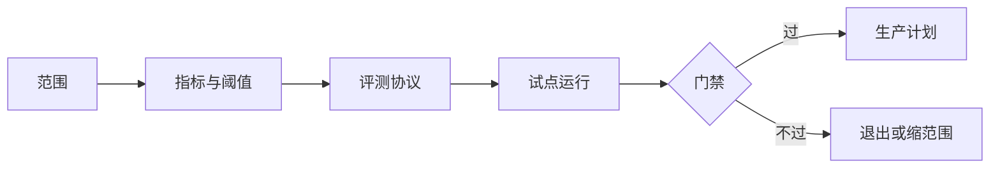

# 03 · 试点验收标准 Pilot Acceptance

一句话直觉：试点若无事先写明的验收，结束时只能靠「感觉很惊艳」——那是销售胜利、工程负债；验收标准把惊艳变成**可重复的门禁**。

## 直觉讲解

**试点验收**是范围上的可测承诺：在约定数据、用户、时间内，达到哪些指标算过，达不到如何退出或整改。它连接发现/范围与生产化，避免 POC 永恒化。

好验收具备 SMART 变体：

| 维度 | 要求 |
|------|------|
| 指标 | 可算（准确、延迟、采用、成本） |
| 数据集 | 金标/抽样协议写清 |
| 用户 | 谁用、多少人、多少周 |
| 环境 | 与生产差异显式列出 |
| 决策 | 过/不过/有条件通过 → 下一步 |

质量类指标要分：**检索/忠实度/任务成功/人工编辑率**，忌只报一个笼统「准确率」。

## 工作示例（数字/场景）

**场景 A：政策问答试点验收（示例数字）**

- 金标 120 问（业务专家标注），离线：  
  - 忠实度抽检 ≥ 90%（人工量规）  
  - 拒答正确率：应拒尽拒 ≥ 95%  
- 在线 4 周，30 名用户：  
  - 周活跃 ≥ 60%  
  - 中位编辑率 ≤ 25%（坐席大改答案比例）  
  - P95 端到端 < 5s  
- 成本：每成功会话 < $X  
- 安全：无越权引用事件（审计抽检 0 容忍）

**场景 B：错误验收**

「领导试用满意」。问题：人变了、题变了就不可复现；无法对抗回归。

**场景 C：有条件通过**

延迟达标、忠实度 85%（目标 90%）。条件：加 2 周只做坏案例修复与再测，不扩用户面——写进纪要。

## 面试常问取舍

1. **离线高分 vs 线上低采用**  
   - 验收应同时含质量与采用；单边通过不算过。  

2. **LLM-as-judge 能否当验收？**  
   - 可作代理，但关键门禁需人工量规校准（评测轨）。  

3. **阈值谁定？**  
   - 业务定「痛苦是否减轻」；工程定「是否可测/可值班」。共同签字。  

4. **达不到是否算失败？**  
   - 失败退出是健康结果；比扩大范围硬撑更专业。

## FDE 现场怎么用

- **Kickoff 当天**草稿验收，结束前冻结版本。  
- **每周看板**：指标距阈值差距，不只燃尽功能。  
- **演示日**：先展示验收表，再 Demo——锚定评价尺度。  
- **进入生产**：验收证据附在生产提案；缺证据不谈 99.9% SLA。

## 与本库其他篇的链接

- 同轨：[02-模糊问题定范围Scoping](./02-模糊问题定范围Scoping.md)、[06-AI价值兑现Benefits-Realization](./06-AI价值兑现Benefits-Realization.md)、[08-现场Demo翻车救援](./08-现场Demo翻车救援.md)  
- 评测：[金标数据集与Eval集](../03-评测与ML基础/06-金标数据集与Eval集.md)、[评测RAG系统](../03-评测与ML基础/09-评测RAG系统.md)、[忠实度vs答案相关性](../03-评测与ML基础/24-忠实度vs答案相关性.md)  
- 交付：[POC到生产](../../02-交付方法论/POC到生产.md)、[客户成果方法论](../../02-交付方法论/客户成果方法论.md)  
- 面试：[客户模拟操练](../../04-面试通关/客户模拟操练.md)、[Take-home与演示](../../04-面试通关/Take-home与演示.md)

## 深入：验收协议怎么写才不扯皮

### 最小章节

1. 目标用户与排除用户  
2. 指标定义（分子分母）  
3. 数据与标注流程  
4. 环境差异清单  
5. 通过/有条件/不通过决策人  
6. 时间表与冻结规则  

### 指标拆分表示例

| 指标 | 定义 | 阈值 | 证据 |
|------|------|------|------|
| 任务成功 | 坐席一次解决 | ≥ 基线 +10pt | 工单标签 |
| 忠实 | 无证据外关键事实 | ≥ 90% | 双人抽检 |
| 延迟 | 首字/整段 P95 | < 2s / < 5s | APM |
| 采用 | 周活/合格用户 | ≥ 60% | 产品分析 |

### 反模式

- 验收只在 PPT。  
- 金标由开发自己出题自己答。  
- 试点环境用「干净数据」，生产全是脏 PDF。

## 课堂小结

验收是试点的产品规格。下一篇练习：如何把技术取舍讲给非工程师，让门禁数字变得可决策。

## 验收争议仲裁规则（建议写进纪要）

1. 指标定义冲突 → 以 Kickoff 冻结版为准，新定义进下一试点盒。  
2. 抽样争议 → 双人盲评，第三人破平。  
3. 环境差异导致失败 → 先判定是否「环境假设」问题，再判产品失败。  
4. 赞助人口头「我觉得过了」但数字未达标 → 记为「业务豁免」，不改写工程门禁历史。

无仲裁规则的验收，最后会变成职级最高者的印象分。

## 参考与来源

- 原创综述：试点验收门禁与证据（本篇）  
- 本库 POC到生产、客户成果、RAG 评测篇  
- 面试通关中的客户模拟与演示文档
