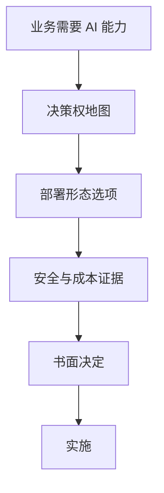

# 05 · 部署决策权 Deployment Decision Rights

一句话直觉：部署形态（SaaS / BYOC / 专有云 / 气隙）往往不是技术最优解，而是**谁有权拍板、谁承担风险**的组织问题——先找决策权，再画架构。

## 直觉讲解

**部署决策权**厘清：对数据驻留、出网、身份、密钥、变更窗口、事故责任，哪些角色有否决权/建议权/知情权。RACI 不够时，至少要「D（决定）是谁」。

常见角色：

| 角色 | 常关心 |
|------|--------|
| 业务赞助人 | 上线时间与效果 |
| 安全/合规 | 驻留、审计、供应商 |
| 平台/Infra | 网络、K8s、密钥 |
| 法务/采购 | 合同与数据条款 |
| 你（FDE） | 可行路径与证据 |

无决策权地图的典型症状：每周对齐会都「原则同意」，环境申请永远卡在匿名队列。

## 工作示例（数字/场景）

**场景 A：安全一票否决**

业务要两周 SaaS 试点；安全要求数据不出园区。  
错误：与业务对打工期。  
正确：把安全标为 **D（决定驻留）**，业务为 **A（负责成果）**；提案改为 VPC/BYOC 瘦切片，或脱敏抽样出境的**书面例外**——双路径呈报，让有权的人签。

**场景 B：平台团队是隐藏 D**

模型网关必须走企业统一出口。你私建隧道会政治死亡。决策权：平台拥有出网，你拥有应用配置——提前联合设计。

**场景 C：采购周期**

气隙需要的硬件采购 12 周，试点只要 4 周。决策权拆分：试点用隔离 VPC；气隙作为 Phase 2，由赞助人确认序列——避免假承诺。

## 面试常问取舍

1. **FDE 能否替客户做部署决定？**  
   - 不能替签风险。你提供选项与后果，推动正确的人决定。  

2. **被夹在安全与业务之间**  
   - 公开冲突到同一张选项表；私下传话会输。  

3. **「先做了再补合规」**  
   - 高监管行业是职业风险；记录反对意见与升级路径。  

4. **多区域谁决定故障转移？**  
   - 预先指定；事故中争论决策权是二次事故。

## FDE 现场怎么用

- **第一周产出**：一页 Decision Rights（主题→D/A/C/I→截止日）。  
- **架构评审**：每个箭头问「跨边界是否已获 D 同意」。  
- **纪要句式**：「关于 X，由 Y 在 Z 日前决定；选项见附件。」  
- **与范围联动**：部署形态进 Scope In/Out，不进口头。

## 与本库其他篇的链接

- 同轨：[02-模糊问题定范围Scoping](./02-模糊问题定范围Scoping.md)、[04-向非工程师讲清取舍](./04-向非工程师讲清取舍.md)、[07-干系人管理Stakeholder](./07-干系人管理Stakeholder.md)  
- 概念：[部署模型SaaS-BYOC-OnPrem-气隙](../04-生产系统设计/18-部署模型SaaS-BYOC-OnPrem-气隙.md)、[VPC与气隙部署](../04-生产系统设计/08-VPC与气隙部署.md)、[企业部署模型选型](../01-LLM与GenAI基础/29-企业部署模型选型.md)  
- 能力：[气隙与战术边缘部署](../../05-能力补强/气隙与战术边缘部署.md)  
- 面试：[客户模拟操练](../../04-面试通关/客户模拟操练.md)、[Palantir-FDSE面试指南](../../04-面试通关/Palantir-FDSE面试指南.md)

## 深入：决策权表示例

| 主题 | D 决定 | A 负责推进 | C 咨询 | I 知情 |
|------|--------|------------|--------|--------|
| 数据是否出网 | CISO | 业务赞助人 | 法务、FDE | 平台 |
| 模型供应商 | 架构委员会 | FDE | 安全 | 业务 |
| 试点用户范围 | 业务赞助人 | 业务经理 | FDE | 安全 |
| 生产变更窗口 | 平台 | FDE | 业务 | 客服 |

### 升级路径

分歧超过约定日 → 上升到赞助人+安全负责人联席；仍无果 → 暂停开发（比瞎做便宜）。

### 反模式

- 把「会议点头」当决定，无署名。  
- 让最积极的工程师当 D。  
- 忽视采购与法务的静默否决权。

## 课堂小结

决策权是部署的真正关键路径。下一篇谈价值兑现：上线之后如何证明钱与风险真的动了。

## 进场首周访谈名单（最低集）

| 必访 | 要拿到的产出 |
|------|----------------|
| 业务赞助人 | 成果定义与时间盒 |
| 安全接口人 | 驻留红线与例外流程 |
| 平台/网络 | 出网、DNS、证书路径 |
| 身份管理员 | SSO/服务账号可行性 |
| 一线代表 | 真实作业与怕什么 |

缺访就开建，是部署决策权事故的最常见前兆。

## 决定未下达时的工程纪律

- 可继续：不依赖未决边界的 Walking Skeleton（假数据/脱敏）。
- 不可继续：真实数据出境、生产写路径、采购锁定。
- 每日站会问：是否有人在「假装已经批准」？

写进口头禅：「决定是谁签的？」比「架构漂不漂亮？」更能预测交付日期。

## 参考与来源

- 原创综述：部署形态背后的组织决策权（本篇）  
- 本库部署模型、VPC/气隙、客户模拟  
- RACI/决策权思想的现场裁剪（非照搬外站课文）
