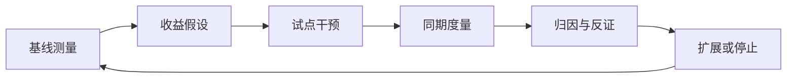

# 06 · AI 价值兑现 Benefits Realization

一句话直觉：模型上线≠价值兑现；兑现是**基线 → 干预 → 度量 → 归因 → 扩展/停止**的管理闭环，把「惊艳」变成账本与风险账上的移动。

## 直觉讲解

**Benefits Realization（价值兑现）**来自成果管理：收益要有主人、指标、时间与证据。AI 项目特别容易停在 Demo 层——因为生成内容「看起来像价值」。

闭环：



收益类型要分开：

| 类型 | 例 | 证据难度 |
|------|----|----------|
| 效率 | AHT↓、起草时间↓ | 中（要控混淆） |
| 质量 | 差错↓、合规事件↓ | 高（低频） |
| 体验 | CSAT↑ | 中 |
| 风险 | 越权/幻觉外发↓ | 高但关键 |
| 收入 | 转化↑ | 需实验设计 |

单位经济：[AI成本与单位经济](../04-生产系统设计/02-AI成本与单位经济.md) 必须进兑现表，否则「更准但更亏」。

## 工作示例（数字/场景）

**场景 A：坐席助手**

- 基线：AHT 12.0 min，二次进线 18%  
- 假设：助手使 AHT → 10.5，二次进线 → 15%  
- 设计：30 人实验组 / 30 人对照组，4 周  
- 成本：+$0.12/会话  
- 兑现门槛：AHT 降幅 ≥ 1 min 且质量抽检不恶化  
- 结果：AHT ↓0.4（不足）；编辑率显示信任不足 → 不扩展，先改检索与培训  

这是健康失败：避免全公司铺开沉没。

**场景 B：只有「节省人天」故事**

宣称省 10 FTE，但编制未变、工单量上涨。兑现要挂钩**可转移的产能**或明确的外包缩减，否则是叙事。

**场景 C：风险收益**

合规要的是「外发幻觉事件 = 0」。即使效率不变，风险归零也可能值——把「避免的损失」写进赞助人语言。

## 面试常问取舍

1. **归因困难**  
   - 承认季节性/政策变化；用对照、差分、分段上线。  

2. **领先指标 vs 滞后指标**  
   - 采用率、编辑率领先；财务滞后。验收可分阶段。  

3. **谁拥有收益？**  
   - 必须是业务赞助人；FDE 拥有测量系统与干预设计。  

4. **停项目是否丢脸？**  
   - 在错误假设上止损是兑现体系的一部分。

## FDE 现场怎么用

- **立项**：收益假设进 Scope；无假设不进开发。  
- **仪表盘**：同一页看质量、采用、成本、事故。  
- **月度兑现会**：赞助人主持，不单是技术站会。  
- **扩展门槛**：书面；未达标不「先铺再说」。

## 与本库其他篇的链接

- 同轨：[03-试点验收标准Pilot-Acceptance](./03-试点验收标准Pilot-Acceptance.md)、[04-向非工程师讲清取舍](./04-向非工程师讲清取舍.md)  
- 交付：[客户成果方法论](../../02-交付方法论/客户成果方法论.md)、[POC到生产](../../02-交付方法论/POC到生产.md)  
- 评测：[离线vs在线评测](../03-评测与ML基础/12-离线vs在线评测.md)、[AB-金丝雀-影子测试](../03-评测与ML基础/10-AB-金丝雀-影子测试.md)  
- 生产：[AI成本与单位经济](../04-生产系统设计/02-AI成本与单位经济.md)  
- 面试：[客户模拟操练](../../04-面试通关/客户模拟操练.md)、[CASE框架与Delta案例](../../04-面试通关/CASE框架与Delta案例.md)

## 深入：收益假设卡片

```text
收益名：
受益者：
基线（数字+日期+数据源）：
干预：
领先指标 / 滞后指标：
混淆因素与控制：
成本增量：
兑现主人（业务）：
复盘日：
```

### 反模式

- 用模型 benchmark 分数代替业务收益。  
- 基线在上线后补测（不可信）。  
- 成功时归 AI，失败时归用户「不会用」——双标杀死信任。

### 与试点验收关系

验收 = 「是否值得进入兑现期」；兑现 = 「是否值得扩展预算」。二者阈值可以不同，但要显式。

## 课堂小结

价值兑现让 FDE 对账本负责，不只对 Demo 负责。下一篇管理多元干系人——兑现会背后的人。

## 价值叙事的诚实层级

1. **已兑现**：对照完成、数字进仪表盘、编制或费用已调整  
2. **方向性正面**：领先指标改善，滞后指标未到  
3. **未兑现**：故事好看但账不动——停止美化，启动止损或改假设  

对外材料只允许使用第 1、2 层，并标注层级。把第 3 层包装成第 1 层，是摧毁长期信任的捷径。

## 参考与来源

- 原创综述：AI 项目收益闭环与归因（本篇）  
- 本库客户成果方法论、A/B 与成本篇  
- 成果管理（benefits realization）通用思想的 AI 场景裁剪
