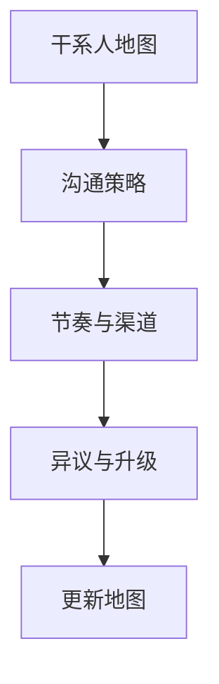

# 07 · 干系人管理 Stakeholder

一句话直觉：项目死于未管理的人，而非未调的超参——干系人管理是持续识别**影响力×利益**，设计沟通频率与异议处理，把反对者变成可合作的约束来源。

## 直觉讲解

**干系人**：能影响或被项目影响的人/组织。管理不是搞关系术，而是：

1. 地图：谁有否决权、谁受害、谁冷漠但需要时堵你  
2. 策略：争取 / 满足 / 告知 / 监控（经典影响力-利益四分）  
3. 节奏：同步内容与频率匹配其决策权  
4. 异议：先承认合理担忧，再给证据路径  

FDE 常见关键角色：业务冠军、怀疑派专家、安全、平台、一线用户代表、采购。忽略一线只哄高层 → 上线零采用。

## 工作示例（数字/场景）

**场景 A：怀疑派专家**

资深坐席领袖公开说「AI 会害人」。错误：回避。正确：

- 承认其历史坏 Demo 经验成立  
- 请其进验收量规设计（拥有标准）  
- 先做「检索+引用」小能力，不做自动发送  
往往从否决者变为质量守门人。

**场景 B：多赞助人冲突**

市场要速度，风控要慢。用决策权篇的表把冲突公开；FDE 不私下选边，只提供选项后果。

**场景 C：隐形干系人**

共享服务台改 API 版本无人通知 → 试点断一周。地图应含「依赖系统的变更管理员」，纳入 C/I。

## 面试常问取舍

1. **把怀疑者当敌人？**  
   - 挂。应先承认担忧中的真风险（行为面高频）。  

2. **汇报上行忽略下行**  
   - 采用发生在一线；两线都要有代表。  

3. **沟通过多**  
   - 高层要决策摘要；专家要细节附录。同会不同材料。  

4. **失败归责**  
   - 复盘对事；对人用「角色缺口」而非羞辱——面试「失败项目」题同理。

## FDE 现场怎么用

- **Kickoff**：画出地图，贴在项目空间。  
- **每周**：更新「态度变化」与「未关闭异议」。  
- **一对一**：对否决权角色固定节奏，勿只群发。  
- **文档**：异议登记（担忧→证据→状态）。  

## 与本库其他篇的链接

- 同轨：[01-需求发现Requirements-Discovery](./01-需求发现Requirements-Discovery.md)、[05-部署决策权Deployment-Decision-Rights](./05-部署决策权Deployment-Decision-Rights.md)、[08-现场Demo翻车救援](./08-现场Demo翻车救援.md)  
- 交付：[客户沟通与阻力处理](../../02-交付方法论/客户沟通与阻力处理.md)、[咨询思维与软技能栈](../../02-交付方法论/咨询思维与软技能栈.md)  
- 面试：[行为面STAR题库](../../04-面试通关/行为面STAR题库.md)、[客户模拟操练](../../04-面试通关/客户模拟操练.md)、[价值观与招聘经理操练](../../04-面试通关/价值观与招聘经理操练.md)

## 深入：地图与策略表

| 干系人 | 利益 | 影响 | 策略 | 渠道 | 频率 |
|--------|------|------|------|------|------|
| 赞助人 | 成果 | 高 | 紧管 | 30min 决策会 | 双周 |
| 安全 | 风险 | 高 | 紧管 | 架构评审 | 按门禁 |
| 一线领袖 | 负担 | 中高 | 满足 | 跟岗/试用 | 周 |
| 一般用户 | 体验 | 低 | 告知 | 简报 | 里程碑 |
| 外围 IT | 工单 | 中 | 监控 | 工单抄送 | 变更时 |

### 「把怀疑者变冠军」四步

1. 复述其担忧至对方点头  
2. 把担忧写进验收/护栏  
3. 联合做一次坏案例复盘  
4. 公开归功其质量标准  

### 反模式

- 只培养一个冠军，冠军休假项目停。  
- 用术语羞辱非技术反对者。  
- 冲突靠「再演示一次」解决（该用决策权）。

## 课堂小结

干系人地图是活文档。下一篇（本轨收束）处理最高压时刻：现场 Demo 翻车如何救援。

## 一周沟通节奏示例

| 对象 | 形式 | 内容 |
|------|------|------|
| 赞助人 | 25min | 决策项 + 红黄绿 |
| 安全 | 按门禁 | 证据包，不闲聊架构梦想 |
| 一线领袖 | 跟岗/试用复盘 | 坏案例与负担 |
| 全员相关方 | 邮件简报 | 里程碑与明确非目标 |

节奏写进项目计划，比「有事再说」更像可交付的专业服务。

## 干系人健康度速查

- 是否存在唯一崩溃点冠军？
- 否决权角色是否超过两周未同步？
- 一线声音是否只出现在抱怨阶段？
- 异议登记是否有超过 SLA 未关项？

写进口头禅：「决定是谁签的？」比「架构漂不漂亮？」更能预测交付日期。

## 参考与来源

- 原创综述：FDE 干系人地图、异议与怀疑者合作（本篇）  
- 本库客户沟通与阻力处理、行为面 STAR、客户模拟  
- 影响力-利益分析等通用管理框架的现场裁剪
