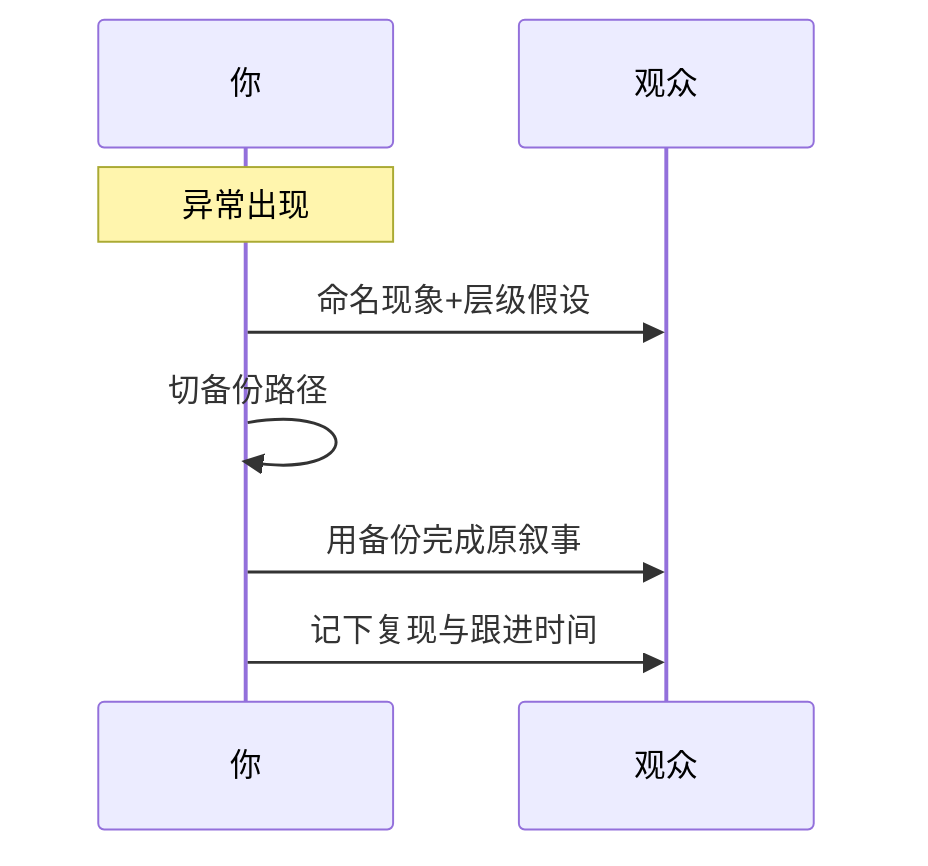

# 08 · 现场 Demo 翻车救援

一句话直觉：Demo 会翻车；专业不在永不失败，而在**十秒内保护信任**——诚实命名问题、切备份路径、收回叙事权，再离线修根因。

## 直觉讲解

现场演示是高杠杆信任事件。翻车类型：

| 类型 | 例 |
|------|-----|
| 环境 | VPN、证书、防火墙 |
| 数据 | 索引空、权限拒绝 |
| 模型 | 超时、拒答、胡言 |
| 产品 | 按钮挂、SSE 断 |
| 人因 | 问了从未测过的题 |

**救援原则：**

1. **不装没事**——观众有眼  
2. **命名问题层级**——网络 / 应用 / 模型  
3. **切换预案**——录屏、只读备环境、脚本化问答  
4. **收回目标**——今天要验证的学习是什么  
5. **跟进承诺**——何时给根因与修复证据  

## 工作示例（数字/场景）

**场景 A：模型现场幻觉**

问到敏感政策，答案自信但无引用。  
救援话术：「这个回答缺少引用，按我们的护栏应拒答或给来源——我切换到带强制引用的模式/金标问题。这正是验收要卡的点。」  
然后演：拒答或正确引用。把事故变成「护栏价值」展示，而非遮丑。

**场景 B：VPN 掉线**

三秒确认；切本地录屏 + 叙述架构；不现场折腾 20 分钟连网。事后发环境检查清单给客户 IT。

**场景 C：观众随机难题**

「很好的边界题；不在今天试点范围，我记下来进金标坏案例。先回到验收场景 A。」——保护范围，同时尊重对方。

**场景 D：缓存了错误答案**

旁路缓存重试；若仍错，展示日志中的检索证据，邀请一起看——透明 > 甩锅供应商。

## 面试常问取舍

1. **是否继续 Debug？**  
   - 超过 ~2 分钟无进展 → 切预案。面试/客户同样讨厌沉默敲键盘。  

2. **是否怪客户网络？**  
   - 可陈述事实，但带解决方案与共同检查项；纯甩锅丢分。  

3. **翻车是否等于失败项目？**  
   - 一次 Demo ≠ 试点结论；用验收数据说话。  

4. **要不要幽默？**  
   - 轻度可以；自嘲过度像不专业。优先冷静结构。

## FDE 现场怎么用

**事前（强制）：**

- 主路径 + 备份路径 + 录屏  
- 金标 5 问必过；禁临时发挥生产账号  
- 检查：时钟、证书、配额、特性旗标、缓存版本  
- 角色：一人演示、一人旁观者控场  

**事中：**

- 超时话术模板背熟  
- 白板可画架构，证明你懂系统不止会点 UI  

**事后 24h：**

- 根因、是否验收相关、修复、防再发  
- 感谢指出问题的人（干系人篇）  

## 与本库其他篇的链接

- 同轨：[03-试点验收标准Pilot-Acceptance](./03-试点验收标准Pilot-Acceptance.md)、[07-干系人管理Stakeholder](./07-干系人管理Stakeholder.md)、[04-向非工程师讲清取舍](./04-向非工程师讲清取舍.md)  
- 交付：[反模式与踩坑](../../02-交付方法论/反模式与踩坑.md)、[客户沟通与阻力处理](../../02-交付方法论/客户沟通与阻力处理.md)  
- 工程：[08-并发与GIL](../09-编码与工程手艺/08-并发与GIL.md) 无关直接，但 [缓存与淘汰](../09-编码与工程手艺/07-缓存与淘汰.md)、[可测试性](../09-编码与工程手艺/02-可测试性与依赖注入.md) 降低翻车率  
- 面试：[Take-home与演示](../../04-面试通关/Take-home与演示.md)、[客户模拟操练](../../04-面试通关/客户模拟操练.md)、[行为面STAR题库](../../04-面试通关/行为面STAR题库.md)

## 深入：话术与检查清单

### 十秒话术骨架

「我看到的是【现象】。最可能在【层级】。我先切到【备份】把今天要验证的【学习目标】走完，然后【时间】给你们根因。」

### Demo 前 15 分钟清单

- [ ] 备份环境可登录  
- [ ] 录屏可播  
- [ ] 金标问答跑通一遍  
- [ ] 配额与区域正确  
- [ ] 特性旗标与提示版本确认  
- [ ] 旁观者网络与账号独立  

### 反模式

- 「等一下它有时会这样」循环刷新。  
- 指责观众问题出得偏。  
- 翻车后加班加戏扩范围谢罪——应修门禁而非献祭。

### 把翻车写进 STAR

情境-翻车-你的救援动作-信任结果/流程改进。面试「失败」题的优质素材。

## 课堂小结

救援能力是客户面手艺的最终压力测试：保护信任、守住范围、留下证据。本轨八篇从发现走到现场，可与交付方法论及面试客户模拟交叉操练。

## 参考与来源

- 原创综述：Demo 翻车分层、话术与预案（本篇）  
- 本库 Take-home与演示、客户模拟、行为面 STAR  
- 公开概念地图中客户场景（含 demo 翻车类行为题）之展开
