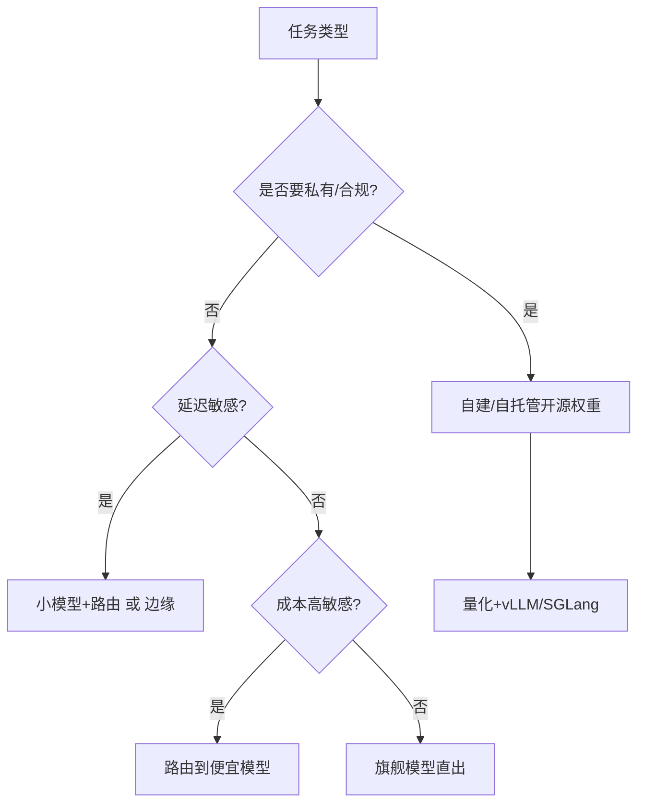

# 2026 模型与平台格局

一句话直觉：选模型不是「选最强」，而是「在能力、成本、延迟、合规、可控性五条约束里找 Pareto 最优点」。FDE 的价值，就是替客户把这道多选题做对。

## 1. 决策框架（先框定，再选型）

四条硬约束，按优先级排：

| 约束 | 典型问题 | 不满足的后果 |
|------|----------|--------------|
| 合规/数据主权 | 数据能出域吗？ | 直接否决选型 |
| 能力下限 | 任务需不需要长推理/多模态 | 做不了就换模型 |
| 成本 | 每千次调用多少钱 | 没法规模化 |
| 延迟 | P95 多少秒能接受 | 体验崩 |

## 2. 闭源旗舰（API 优先）

> 以下为 2026 年中的「格局画像」，具体版本号与价格随时间变化，落地前务必查官方文档。

| 厂商 | 定位 | 适合 | 注意 |
|------|------|------|------|
| OpenAI | 通用旗舰 + 生态最全 | 大多数场景默认兜底 | 数据出域需企业协议 |
| Anthropic | 长上下文、代理/编码强 | Agent、长文档、稳健输出 | 同样看数据协议 |
| Google | 多模态 + 超长上下文 + TPU 成本 | 海量文档、视频、跨模态 | 国内可达性 |
| 国产一线（Qwen / DeepSeek / 阶跃等） | 中文强、可自托管、合规友好 | 国内业务、私有化 | 看开源协议与商用条款 |

**FDE 现场经验**：别迷信单一厂商。把「路由层」做薄但存在——简单任务走小/便宜模型，复杂任务才升级旗舰，账单能差一个数量级。

## 3. 开源/自托管（可控优先）

何时选自托管：

- 数据不能出域（金融、政企、医疗）
- 需要微调/改权重
- 调用量极大，API 单价不划算
- 需要确定性部署（版本锁定）

代表路线：

| 路线 | 说明 | 工具 |
|------|------|------|
| 稠密开源权重 | Qwen / Llama 系，社区最活跃 | vLLM / SGLang |
| MoE 开源权重 | 推理时只激活部分专家，吞吐高 | SGLang 对 MoE 友好 |
| 量化部署 | 用 INT4/FP8 把显存打下来 | vLLM、llama.cpp |

见 [推理部署实战](./推理部署实战-vLLM与SGLang.md) 把服务真正跑起来。

## 4. 选型速查表（给客户的 30 秒建议）

| 场景 | 默认建议 |
|------|----------|
| 内部知识库问答（数据敏感） | 自托管 Qwen + RAG，vLLM 部署 |
| 客服助手（高并发、预算紧） | 路由：80% 小模型，20% 旗舰兜底 |
| 长文档分析/尽调 | 旗舰长上下文模型 |
| 编码 Copilot | 编码强模型 + 上下文缓存 |
| 跨模态（图/视频/表） | 多模态旗舰 |

## 5. 反模式

- **「直接上最强模型」**：预算和延迟都扛不住，且多数请求用不到满血能力。
- **「只看榜单分」**：榜是平均，你的场景是长尾；用你自己的 Eval 说话（见 [评测 Harness 速成](./评测Harness速成.md)）。
- **「忽视版本漂移」**：模型会更新，生产要锁定版本并做回归。

## 参考与来源

- OpenAI / Anthropic / Google / 阿里云 Qwen 官方模型文档与定价页（2026 年中）
- 上游 [docs/10-概念课程/01-LLM与GenAI基础/29-企业部署模型选型.md](../../10-概念课程/01-LLM与GenAI基础/29-企业部署模型选型.md)
- 本篇为 JackQi748 2026 迭代增补，观点原创，未逐字搬运外站
