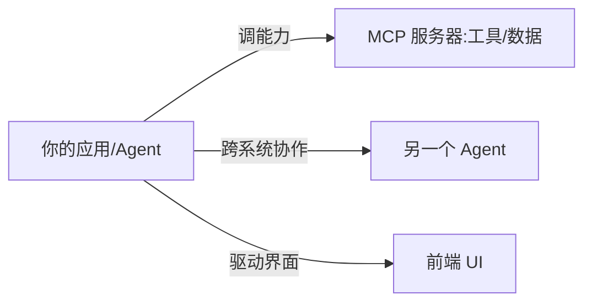

# Agent 协议全景 2026

一句话直觉：Agent 协议解决的是「模型怎么安全、可组合地调外部能力」。2026 年基本收敛成三层——**MCP 接工具、A2A 接 Agent、AG-UI 接前端**。FDE 要会按场景选，而不是全堆 MCP。

## 1. 三层地图



| 协议 | 解决 | 类比 | 谁在用 |
|------|------|------|--------|
| MCP（Model Context Protocol） | 模型↔工具/数据源 的标准接口 | 「USB-C for AI」 | 各大模型/IDE 事实标准 |
| A2A（Agent2Agent） | Agent↔Agent 的发现与协作 | 「微服务间 RPC」 | Google 主导，跨厂商 |
| AG-UI | Agent↔前端 UI 的实时交互 | 「Agent 的 WebSocket」 | Copilot 类前端 |

## 2. MCP：先把工具标准化

核心概念：

- **MCP Server**：暴露 `tools` / `resources` / `prompts` 的本地或远程服务。
- **MCP Client**：你的 Agent 运行时（Claude Desktop、IDE、自写 Loop）。
- **Transport**：stdio（本地）或 HTTP+SSE（远程）。

最小 server 思路（Python，伪代码骨架）：

```python
# 用官方 SDK：pip install mcp
from mcp.server import Server

app = Server("demo")

@app.list_tools()
async def list_tools():
    return [{
        "name": "get_weather",
        "description": "查天气",
        "inputSchema": {
            "type": "object",
            "properties": {"city": {"type": "string"}},
            "required": ["city"],
        },
    }]

@app.call_tool()
async def call_tool(name, args):
    if name == "get_weather":
        return [{"type": "text", "text": f"{args['city']} 晴，25℃"}]
```

FDE 现场用法：把客户的内部系统（CRM、工单、数据库）包成 MCP Server，Agent 就能安全调用，而不用把密钥塞进 prompt。

## 3. A2A：让 Agent 互相找、互相派活

适用：你的 Agent 需要调用**另一个组织的 Agent**（它不暴露 MCP 工具，只暴露「我能干啥」）。

- Agent Card：自我介绍（能力、端点、鉴权）。
- Task：异步任务模型，支持流式进度。
- 与 MCP 不冲突：A2A 负责「找谁干」，MCP 负责「怎么调工具」。

## 4. AG-UI：把 Agent 接到界面

负责把 Agent 的「思考、工具调用、流式输出、状态」实时映射到前端组件。做内部 Copilot / 客户 Demo 时，这层决定「看起来智不智能」。

## 5. 选型决策

| 你要做 | 选 |
|--------|----|
| 让模型调你的内部 API/数据 | MCP Server |
| 跨厂商/跨系统 Agent 协作 | A2A |
| 给 Agent 做实时前端 | AG-UI |
| 全都要 | MCP 打底 + A2A 互联 + AG-UI 展示 |

## 6. 反模式

- **所有能力硬写进 prompt**：换个系统就改代码；用 MCP 解耦。
- **把 A2A 当 MCP 用**：A2A 是 Agent 间协作，不是工具接口。
- **忽视鉴权**：MCP Server 暴露内部系统，必须最小权限 + 审计。

## 参考与来源

- MCP 规范：https://modelcontextprotocol.io
- A2A 项目：https://github.com/google/A2A
- AG-UI 协议：https://docs.ag-ui.com
- 上游 [docs/10-概念课程/02-检索与Agent/14-MCP模型上下文协议.md](../../10-概念课程/02-检索与Agent/14-MCP模型上下文协议.md)
- 本篇为 JackQi748 2026 迭代增补
