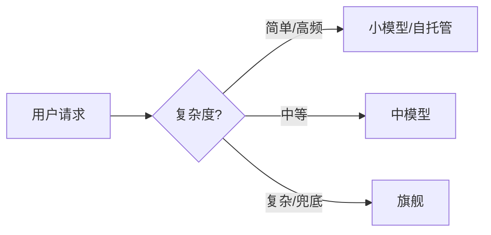

# 成本优化手册

一句话直觉：LLM 账单 80% 由「上下文长度 × 调用次数 × 单价」决定。省钱不是砍能力，是在对的环节用对的模型、把重复算力消掉。

## 1. 成本公式（先算清楚）

```
单次调用成本 ≈ input_tokens × 输入单价 + output_tokens × 输出单价
月度成本   ≈ 单次成本 × 调用次数 × 缓存命中率的影响
```

三个杠杆按性价比排序：

| 杠杆 | 典型收益 | 难度 |
|------|----------|------|
| 模型路由 | 省 50–90% | 低 |
| 上下文/提示缓存 | 省 30–70% | 低 |
| 量化/自托管 | 省 1–2 个数量级（大流量） | 中 |

## 2. 模型路由（最便宜的一刀）

把请求分层：



规则示例：

- 分类、抽取、改写 → 小模型
- 摘要、问答 → 中模型 + RAG
- 规划、疑难推理 → 旗舰

> 经验：多数生产流量 60–80% 落在简单层，路由后账单常降一个数量级。

## 3. 提示/上下文缓存（几乎免费的胜利）

- **前缀缓存**：system prompt、长知识背景固定前缀，命中后不再重复计费编码。vLLM `--enable-prefix-caching`，API 侧用 cache_control。
- **语义缓存**：相同问题直接返回历史答案，跳过一次推理。

| 缓存 | 挡什么 | 注意 |
|------|--------|------|
| 前缀缓存 | 重复 system/上下文编码 | 前缀要稳定 |
| 语义缓存 | 重复问题推理 | 设命中阈值，避免答非所问 |

## 4. 上下文瘦身

- 检索只取 top-k 必要片段，宁少勿滥（配合重排）。
- 历史对话做摘要/截断，别把整段对话每轮全量回传。
- 用更小、更准的 embedding 模型做检索，检索侧成本也省。

## 5. 量化与自托管（大流量才值）

当月调用量够大，API 单价 × 量 > 显卡折旧 + 电费 + 运维，就选自托管：

| 手段 | 效果 |
|------|------|
| FP8 量化 | 显存↓、吞吐↑，质量损失小 |
| INT4 量化 | 显存再↓，质量需 Eval 验证 |
| 批处理/连续批 | 把 GPU 吃满，摊薄单价 |

> 决策点：先接 API 跑通验证需求，再在成本拐点切自托管，不要一上来就买卡。

## 6. 监控指标（让省钱可量化）

- 每用户/每会话平均 token 数
- 缓存命中率
- 路由分布（小/中/大占比）
- 单位业务结果成本（如「一次有效问答 ¥X」）

## 7. 反模式

- **全量上旗舰**：预算烧光，多数请求用不满能力。
- **上下文无脑堆长**：把整本手册塞进 prompt，token 爆炸。
- **不量成本**：没有「单位结果成本」指标，优化无从下手。

## 参考与来源

- 上游 [docs/10-概念课程/01-LLM与GenAI基础/28-Prompt缓存与语义缓存.md](../../10-概念课程/01-LLM与GenAI基础/28-Prompt缓存与语义缓存.md)
- vLLM / 各厂商 API 定价与缓存文档（2026）
- 本篇为 JackQi748 2026 迭代增补
