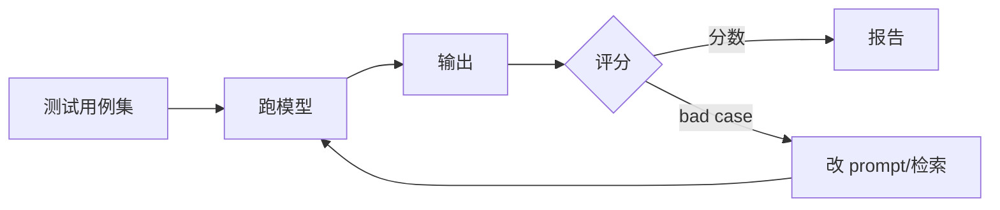

# 评测 Harness 速成

一句话直觉：Eval 不是「上线后看看效果」，而是 FDE 的**设计完成标准**——没有可重复的评测，就不算 Design 完成（见上游 [Discover-Design-Deploy-Review](../../02-交付方法论/Discover-Design-Deploy-Review.md)）。10 分钟搭一个最小闭环，比体感靠谱 10 倍。

## 1. 最小闭环



四件套：**数据集 +  Runner + 评分 + 报告**。

## 2. 数据集（先有 20 条真实样本）

每条：`{输入, 期望/标准答案, 评分标准}`。

```json
[
  {
    "id": "q1",
    "input": "报销单超过 5000 要谁审批？",
    "reference": "部门总监 + 财务复核",
    "criteria": "须同时提到两级审批"
  }
]
```

> 来源可以是历史客服记录、客户提供的标准答案、你自己写的黄金集。**真实 > 多**。先 20 条能跑，再扩。

## 3. Runner（最小可跑）

```python
import json, os
from openai import OpenAI

client = OpenAI(base_url=os.getenv("BASE_URL", "http://localhost:8000/v1"),
                api_key=os.getenv("API_KEY", "EMPTY"))

def run_case(case: dict) -> str:
    resp = client.chat.completions.create(
        model=os.getenv("MODEL", "Qwen/Qwen2.5-7B-Instruct"),
        messages=[{"role": "user", "content": case["input"]}],
    )
    return resp.choices[0].message.content

def score(case: dict, output: str) -> float:
    # 起步用 LLM-as-judge：让一个强模型按 criteria 打 0/1
    judge = client.chat.completions.create(
        model=os.getenv("JUDGE", "gpt-4o"),
        messages=[{
            "role": "user",
            "content": f"按标准给回答打分(只回0或1)。\n标准: {case['criteria']}\n回答: {output}",
        }],
    )
    return float(judge.choices[0].message.content.strip() or 0)

cases = json.load(open("cases.json"))
scores = [score(c, run_case(c)) for c in cases]
print(f"准确率: {sum(scores)/len(scores):.1%}  ({len(scores)} 条)")
```

跑：`BASE_URL=... MODEL=... python eval.py`。这就是你的第一版 Harness。

## 4. 评分三档（按需升级）

| 档 | 方法 | 何时用 |
|----|------|--------|
| 0/1 规则 | 正则/关键字命中 | 抽取、分类 |
| LLM-as-judge | 强模型按 criteria 打分 | 开放问答 |
| 程序化指标 | BLEU/ROUGE/含参考答案重叠 | 有标准答案 |

> 进阶：用 `ragas` / `deepeval` / `evalscope` 直接拿现成指标（ faithfulness、answer relevancy）。

## 5. 把它用进交付节奏

- **设计阶段**：先写 20 条 case，定基线。
- **迭代阶段**：每次改 prompt/检索，重跑，看分数动没动。
- **上线阶段**：设回归门槛（如准确率不低于基线），低于就拦住发布。
- **复盘阶段**：bad case 进数据集，防止复发。

## 6. 反模式

- **用生产流量当 Eval**：没标准答案，无法量化。
- **只评「像不像人话」**：要评「对不对、合不合规」。
- **一次写好再也不跑**：Eval 是活的东西，随场景长。

## 参考与来源

- Ragas：https://docs.ragas.io ｜ DeepEval：https://github.com/confident-ai/deepeval
- 上游 [docs/03-AI落地/评测Eval与Guardrails.md](../../03-AI落地/评测Eval与Guardrails.md)
- 上游 [docs/10-概念课程/02-检索与Agent/17-Agent轨迹评测.md](../../10-概念课程/02-检索与Agent/17-Agent轨迹评测.md)
- 本篇为 JackQi748 2026 迭代增补，代码为最小可运行骨架
